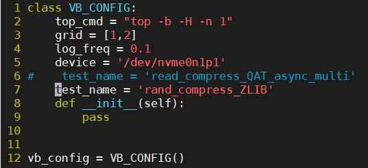

#### 1.13 upstream

---

* **加一个new option --QAT，编译加一个 --withQAT**
  * **build和runtime的option**
* vdo.ko，新装驱动，重新make
* 代码结构：基本靠新文件解决
  * clean代码，添加注释

---

```
【修改代码部分】

代码位置：
cd ~/home/hlguo

目前代码位置
cd home/hlguo/kvdo-qat/vdo-qat-async

multipacker在外层添加的选项：
--vdoPackerThread

添加QAT选项时可以参考的选项：
--writePolicy=async

代码编译
make -C /usr/src/kernels/`uname -r` M=`pwd`
编译通过以后会产生两个ko文件，kvdo.ko和uds.ko

vdo环境位置：
cd /lib/modules/3.10.0-957.5.1.el7.x86_64/
在这里可以看到一个kvdo.ko和uds.ko

代码正确性测试：
cd ~/../
cd home/hlguo/
cd kvdo-qat/asynv-qat/
cp vdo/kvdo.ko /lib/modules/`uname -r`
cp uds/uds.ko /lib/modules/`uname -r`
vdo list 	检查
rmmod kvdo	不是必要
rmmod uds	不是必要
cd /lib/modules/`uname -r`/
depmod -a
modprobe kvdo
如果没有什么特别的反应就说明正确

```

```
【挂载/部署部分】

部署的教程大概在redhat 30.3
VDO部署：Create a VDO volume

#1. 可以通过writePolicy控制同步存储上层的模式，async和sync两个模式
vdo create --name=vdo0 --device=/dev/sdb --vdoLogicalSize=1T --writePolicy=async --verbose
vdo create --name=vdo0 --device=/dev/nvme0n1p1 --blockMapCacheSize=128M --vdoLogicalSize=100G --activate=enabled --deduplication=disabled --compression=enabled --vdoLogicalThreads=2 --vdoPhysicalThreads=2 --vdoHashZoneThreads=2 --vdoCpuThreads=2 --vdoAckThreads=2 --vdoBioThreads=2 --vdoPackerThreads=1 --writePolicy=async --verbose

#2. 用XFS或ext4文件系统来format新的device
mkfs.xfs -K /dev/mapper/vdo0
mkfs.ext4 -E nodiscard /dev/mapper/vdo0

#3. 挂载formated device
mkdir /mnt/VDOVolume
mount /dev/mapper/vdo0 /mnt/VDOVolume && chmod a+rwx /mnt/VDOVolume

create device，格式化，挂载，sync，主要就是这几个
最多就是create的时候指定你需要的参数，比如thread数量

#Final. Remove the VDO Volume
umount /mnt/VDOVolume
vdo remove --name=vdo0
vdo list --all | grep vdo (检查)

```

```
【测试用例】

测试及运行benchmark：
cd ~/project/vdo/vdo-benchmark
python3 run_benchmark.py

如果遇到问题 Device already configured for VDO use：
vdo list	查看占用情况
vdo remove --name=vdo0

如果遇到问题 cannot stop VDO Volume with mounts vdo0
umount /mnt/VDOVolume && vdo remove --name=vdo0

如果遇到问题 Name confilct:
先做vdo remove --name=vdo-benchmark
如果不行
rmmod kvdo
rmmod uds
ls /dev/mapper/ 	查看regular file
rm /dev/mapper/vdo-benchmark
modprobe kvdo
python3 run_benchmark.py

跑脚本前后甚至不需要自己remove，他那个都写在里面了
你只需要modprobe和rmmod

调整测试配置：
vim config.py
这里感觉能改的只有test_name

查看测试结果：
cd logs/
cd compress_LZ4/

logs文件夹中有的现有的测试结果:
compress_LZ4
compress_QAT
compress_QAT_async
compress_QAT_async_multi
compress_qat_large
compress_ZLIB
no_compress
rand_compress_LZ4
rand_compress_LZ4_fixCpuThread
rand_compress_QAT
rand_compress_QAT_async_multi
rand_compress_ZLIB
single_test

ctrl+C强行终止以后：
umount -f /dev/mapper/vdo-benchmark
udevadm settle
vdodmeventd -u vdo-benchmark
dmsetup remove vdo-benchmark
也可以不必这样
vdo remove --name=vdo-benchmark --force

```

```
【测试分析】

测试结果网站：
qat-helin-1:8000
10.67.119.40:8080

如果测试结果没有展示，可能是格式不对
rm -rf rand_compress_ZLIB


一直在运行的指令：
watch -d -n 1 'cat /sys/kernel/debug/qat_c6xx_0000\:3d\:00.0/fw_counters'

这个指令是用来查询QAT相关的request包和response包的

三个重要的参数指标：吞吐量，CPU占用率，压缩率（压缩率是靠手算的）
吞吐量和CPU占用率可以看自动化测试工具，压缩率要手动计算（之后再仔细问一次吧）

网站上直接可以看到的是吞吐量和配置
点进去以后能看到的是CPU占用率，取CPUQ的平均值即可
压缩率（不挂载文件系统的话可能看不到压缩率），方法如下图所示

修改测试用例：
cd ~/project/vdo/vdo-benchmark/
cd lib/
vim fio_helper.py
修改这里的fio_payload指令，write和randwrite分别表示顺序写和随机写，但read有一点问题

单独跑某一个测试的方法：
vdo create --name=vdo0 --device=/dev/nvme0n1p1 --blockMapCacheSize=128M --vdoLogicalSize=100G --activate=enabled --deduplication=disabled --compression=enabled --vdoLogicalThreads=2 --vdoPhysicalThreads=2 --vdoHashZoneThreads=2 --vdoCpuThreads=2 --vdoAckThreads=2 --vdoBioThreads=2 --vdoPackerThreads=1 --writePolicy=async --verbose
可以通过另一种方式获取到指令
cd ~/project/vdo/vdo-benchmark/
cd lib/
vim vdo_helper.py

在正确复制ko及运行后，在哪里跑vdo create都是一样的

对于没有packer的代码版本，会怎么处理 packerthread这个参数呢？
就比如对no_compress来说 1212121 和 1212122 是不是一样的呀

理论上是的 然而看到的结果可能会有些变动
实话说1-2的区间也不是太科学，因为可能还有更高的配置
vdo传一个没用的参数，kvdo会报出来但是不碍事

可以perf top去看cpuq里面有没有调用lz4的decompress

```


```
【其他】

tmux进入：
tmux a -t 0
切换window快捷键：
ctrl+B  S

查询以前跑过的指令 reverse-i-search：
ctrl+R

跑benchmark和单独跑数据不一样的可能原因：
1. 跑benchmark有cache
2. 单独跑的指令其实还漏了什么参数，是benchmark在某些别的地方设置的

服务器上有一块nvme的磁盘，比ssd快，device/nvme0n1p1
p1是分的区，总共分了四个，看分区就能看到

```

* 郭鹤林学长修改multi packer时改过的文件


* 测试工具 cd ~/project/vdo/vdo-benchmark


* config.py

  

* fio_helper.py

  

* vdo_helper.py

  

* logs/

  

* 代码 cd ~/../home/hlguo/

  

* 环境 cd ~/../lib/modules/`uname -r`

  

* 编译成功

  


---


```
找论文的方法：一般找论文有两个方法
1. 一个是在相关会议上找，比如存储相关FAST，VLDB，或者数据相关的ICDE，或者系统综合的ATC这些，另一个就是google scholar上搜一些关键词，比如block layer compression，或者hardware compression等等。
2. 还有一种就是在读过的文章的参考文献中找论文
```


---


```
$ stat [filename]
查看文件属性
Access Time：简写为atime，表示文件的访问时间。当文件内容被访问时，更新这个时间 
Modify Time：简写为mtime，表示文件内容的修改时间，当文件的数据内容被修改时，更新这个时间。 
Change Time：简写为ctime，表示文件的状态时间，当文件的状态权限被修改时，更新这个时间，例如文件的链接数，大小，权限，Blocks数。
```

