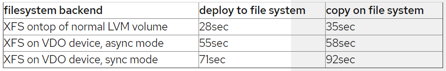
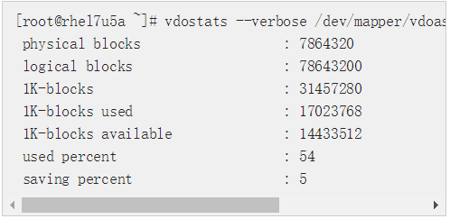
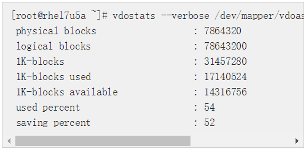

#### 1.2 VDO阅读笔记

---

##### Did you ever feel like you have too much storage?

* VDO (virtual data optimizer) : a transparent compression/deduplication layer
  * trade CPU/RAM resources for disk space
* VDO可以在local filesystem, iSCSI, Ceph下使用；file server可以作为local filesystem的基础，并分发NFS, CIFS, Gluster服务
  * 可以通过iSCSI为每个系统提供单独的映像
  * 这些映像存在具有VDO backend的公共文件系统里，并使用VDO deduplicate对这些映像的公共部分进行压缩
* Problem
  * How to setup and configure VDO?
  * How is VDO influencing read/write performance?
  * How much storage space can I save for my use cases?

---

##### How to setup and configure VDO?

* 关于VDO的权威资源是Storage Administration Guide

```
// 在Linux 7.5安装VDO
yum install vdo kmod-kvdo
```

* 使用VDO的最小系统是一个2GB RAM的KVM
  * 取决于VDO devices下的存储大小
  * 需要注意layer的顺序，比如把VDO置于加密层encryption下就没有意义

```
// 对于可用磁盘/dev/sdc，创建一个VDO
// 这是10GB的磁盘，根据workload不同，可以让VDO给上层提供100GB的logicalsize
vdo create --name=vdoasync --device=/dev/sdc --vdoLogicalSize=100G --writePolicy=async

// 在创建filesystem后，将device挂载到/mnt/vdoasync
mkfs.xfs -K /dev/mapper/vdoasync
```

* VDO支持三种write mode
  * sync mode: 当底层存储将数据持久化写入后，返回对VDO device的写操作
  * async mode: 在底层存储将数据持久化写入前，就返回对VDO device的写操作
    * VDO也遵循来自上层layer的flush request
    * 即使在async mode，也可以安全的处理数据，类似其他有volatile write back cache的device
  * auto mode: 默认模式，根据底层存储的功能选择async或sync的写策略
* sync mode先在media上commit data，再试图做identify duplicate或compress，这意味着，即使读操作比写操作快很多，在连续写操作的时候，sync mode也会慢得多；但是sync mode的latency更低，random IO会更快。sync mode不应该在没有backed storage (比如使用电池的电容的) 的情况下使用
* 用auto mode来选择async或sync是推荐的

---

##### How is VDO influencing read/write performance?

* 如果把VDO放在filesystem layer和block device中间，它会影响filesystem的IO性能
* 以下数据是用spinning disk作后端收集的，在一个32GB RAM和12核2.4GHz的系统上
  * deploy to file system 是把5GB data的directory从RAM复制到filesystem的时间
  * copy on file system 是复制5GB data的directory的时间



* deploy到VDO backend比LVM backend要慢
* VDO backed volume的copy并没有比LVM volume要快
* 当使用SSD或NVDIMM作后端时，应该进行额外调优；VDO的设计目的是正确处理并行IO请求，但上述测试数据没有优化并行；VDO可以将application request分解成多个small request（如果底层media是高速NVMe SSD），这样有助于提高性能
* GNU tar在向 /dev/null 写入数据时，读取数据的速度特别快

---

##### How much storage space can I save for my use cases?

* 使用VDO能节约多少空间取决于数据的可压缩性；还可以调整给use case分配多少cpu/memory，因为VDO volume可以独立地enable deduplication和compression功能
* VDO给自己reserve了3~4GB的空间；这并不是filesystem用来存了什么，而是在做deduplication或compression需要存储空间；这个开销比例的大小会受到device size的影响，在较大的device上(TB级)，VDO的设计开销不会超过2%
* VDO device应该使用thin provisioning，现在的设计下系统告诉application的可用空间比后端实际有的空间要多（先多分配，然后切）；这样就可以从compression和deduplication中获益；和LVM Volume一样，VDO device可以在初始创建后动态增长

```
// 查看actual fillstate的分配，以30GB Volume为例
vdostats --verbose /dev/mapper/vdoasync |grep -B6 'saving percent'
```



* 这个Volume用掉了54%。总容量是30GB，即physical blocks；在上层显示容量为300GB，即logical blocks
* 因为有compression和deduplication，拥有30GB后端也不是意味着只能存储30GB。上面的 vdostats 的输出来自一个13GB的Volume，在复制Volume上额数据后，`df`显示文件系统上的26GB数据。
* 再看一遍数据观察deduplication的效果。多亏了dedup，13GB的复制只占VDO层的120MB 

``````
vdostats --verbose /dev/mapper/vdoasync |grep -B6 'saving percent'
``````



* 把数据复制到VDO支持的设备（separating sync and async mode），...

---

##### Final thoughts

* 在设计VDO时，目前的重点是作为primary storage service，是专门为提升有random IO环境的性能设计的；VDO做诶shared storage，并在上面执行多个IO，甚至可以运行多个VM