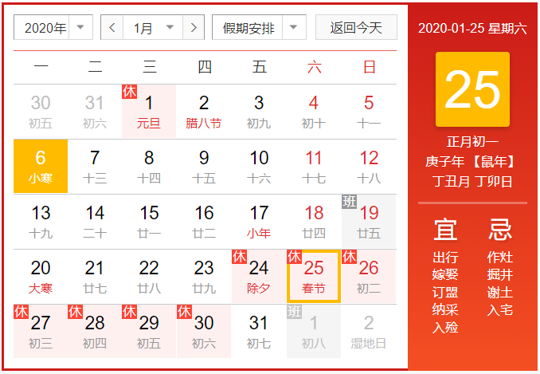

#### Intel 入职培训

---

* circuit ~ mylearning：3-6月内有部分线上课程要学习
* New Employee Orientation
* Intel事业群
  * 全球制造组织暨技术与制造事业群(TechnologyandManufacturingGroup,TMG)
  * 架构事业群(IntelArchitectureGroup,IAG)
    * PC客户端事业群(PCClientGroup,PCG)
    * 数据中心事业群(DataCenterGroup,DCG)
    * 视觉运算事业群(VisualComputingGroup,VCG)
    * 微型移动事业群(UltraMobilityGroup,UMG)
    * 嵌入式及通讯事业群(EmbeddedandCommunicationsGroup,ECG)
    * 数字家庭事业群(DigitalHomeGroup,DHG)
  * 业务暨营销事业群(SalesandMarketingGroup,SMG)
  * 数位企业事业群(DigitalEnterpriseGroup,DEG)
  * PA, MLP, NSG, IPAS
  * SFP/FIV/SIP
  * Employee Resource Groups, ERG
  * ...
* About Intel
  * Intel新的CEO：Bob Swan（第七个）
  * Intel成立于1968年成立
  * 转型：memory/DRAM - multiprocessor - data
  * 总员工10w+，50+个国家，90+ major site，上海员工3000-4000
  * Major site：America，India，China，Ireland
  * 股价：60+ dollar
  * 连续9年当选最有道德的企业
  * 中国site：北京，大连，西安，上海，成都，深圳
  * 英特尔亚太研发有限公司，2005年成立
  * 英特尔最高奖：IAA，intel achieve award
* 每年有一次绩效考评：上一年的deliver，需要改进的地方，比较优秀的方面
* Acronyms
  * AR, action required
  * BKM, best known method
  * F2F, face to face
  * GPTW, great place to work
  * MCM, management commitee member
  * WW, work week
  * WWID, world wide identifier
  * COC, code of conduct, 行为准则
* Corporate security

  * Badging
  * Intel 紧急电话：(6116) 5555
* 一些网站
  * Navigating Circuit：内部主页
  * goto/Workday：工资，报销，个人主页，请假
  * goto/NewtoIntel
  * circuit.intel.com
  * goto/employeecare
  * goto/itfornewhires
  * goto/acronyms

---

* 实习生工资是次月20号结算，要在系统上提交实习天数；正式员工是当月20号结算
* 如果电脑坏了，可以去紫竹1的PC room
  * it.intel.com 或者 电话61161234，修电脑
  * 不允许电脑下班后放在桌面上，要么带走要么锁在柜子里
  * 离开座位要锁屏
  * 紫竹1/2的话在收发室领钥匙
* 4. 申请固定电话已经不需要了，申请一个sky phone，或者申请一个耳机
* 5. 6. 实习生需要在系统上更新很多数据，问一问以前的员工或者buddy是最方便的

* 7. 班车的申请：实习生可以坐班车，正式员工有480补贴；找 Song Hanqiang 去领一张班车卡（61165012），或者买单次班车的票，串班车的话有班车卡就可以了，可以有弹性；Intel的家属不能坐班车

* 8. 申请餐卡，现在其实也不一定申请，也可以用支付宝/微信，押金15元

* 9. 申请员工卡，下午一起做

* 在职证明，工资证明，发邮件给 zizhu.certificate@intel.com
* 入职培训的课表，如果要调整：SH.HRES.onsite.support@intel.com ，预计下一次课是年后第一期，2.3或者2.10 

* 

---

intel VPN: search cisco

skype for business

outlook: mail
	inbox 60days, my folders 365days max
	online active: forever 50G 

intel security checker: update sometimes
	left-bottom button

intel software market
	QQ, wechat, not allow

software problem: 1234
hardware problem: zizhu1 PCS

input method shortcut: shift + Fn