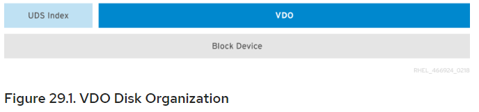
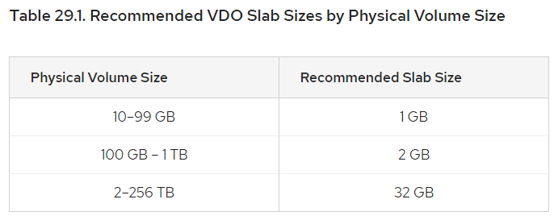

### VDO文档阅读笔记

---

#### Chapter 29. VDO Integration

##### Theoretical Overview of VDO

* VDO：Virtual Data Optimizer
  * easily create compressed of block storage，创建块存储的压缩
  * dedeplicated pools of block storage，重复删除池
* Deduplication：reduce comsuption of storage resources by eliminating multiple copies of duplicate blocks，删除块的重复拷贝啦减少存储资源占用
  * 对于多份相同数据，VDO检测重复块，并将它记录为original block的一个reference；VDO维护一张logical block address到physical block address的map
  * deduplication后，会存在多个logical block address指向同一个physical block address，这被称为shared block；块共享对用户不可见；当一个shared physica block被覆写，会分配一个新的块来存储旧数据，保证映射到shared physica block的其他logical block address不会被修改
* Compression：data-reduction technique，处理那些不一定具有block-level redundancy的文件格式，比如log file和database
* Components of VDO solution
  * kvdo，kernel module，加载到Linux Device Mapper layer，提供deduplicated、compressed、稀疏分布的块存储
  * uds，kernel module，与Universal Deduplication Service (UDS) index 通信，用来分析重复数据

##### The UDS Kernel Module (uds)

* UDS index是VDO的基础；对于新的数据，UDS能快速确定是否与存储过的任何数据块相同；如果发现有相同块，storage system会内部引用已有项，避免重复存储
* UDS index运行在kernel的uds kernel module

##### The VDO Kernel Module (kvdo)

* kvdo kernel module在Linux Device Mapper layer中提供deduplication service；Linux Device Mapper提供管理块存储池的通用框架，允许将块处理模块插入到 kernel block interface和actual storage device driver 之间的 storage stack上
* kvdo模块被视作一个block device，可以直接访问block stoarge，也可以通过Linux文件系统来访问
* 当kvdo收到来自VDO volume的读数据请求，它将logical block映射到physical block，然后返回请求的数据
* 当kvdo收到来自VDO volume的写数据请求，首先判断是否是DISCARD/TRIM请求，判断数据是否uniformly zero；如果有以上情况，kvdo会更新block map并确认请求；如果没有，就为请求分配一个physical block

##### Overview of VDO Write Policies

* 如果kvdo module在同步模式下执行
  * 将request的数据临时写入allocated block，然后acknowledge/响应请求
  * 当acknowledge完成，将通过计算block data的MurmurHash-3 signature（相当于hash）来尝试deduplicate掉这个块，这个signature会发送给VDO index
  * 如果VDO index已经有一个相同signature的entry，kvdo会逐byte比较两个块的内容是否一致
  * 如果内容也是完全一致的，kvdo会更新block map，以便logical block指向相应的physical block，并释放掉之前那个allocated physical block
  * 如果VDO index没有包含这个signature的entry，或比对后内容并不完全一致，kvdo会更新block map，使之前临时的allocated block持久化
* 如果kvdo module在异步模式下执行
  * 立刻响应请求，而不是先write data
  * 用和上面相同的方式来复制数据块
  * 如果block是duplicate的，kvdo会更新block map，然后释放掉allocated block；否则，kvdo会将data写入allocated block，并更新block map，使得physical block持久化

##### VDO Volume

* VDO用block device当备用存储，它可以包含一个或多个磁盘/disks、分区/partitions、flat files的聚合
* VDO volume由storage management tool创建；VDO会为UDS index和VDO volume保留空间，这两者产生交互，一起为user和application提供deduplicated block storage的功能

##### Slabs

* VDO volume的物理存储被划分成许多slab，每个都是physical space的一段连续区域；给所有的slab分配的大小都是相同的，可能是128MB的2倍幂，最大是32GB
* 为了便于在更小的测试系统上评估VDO，默认的Slab大小是2GB；单个VDO volume最多有8096个Slab，在默认设置下最大允许物理存储是16TB；当使用32GB的Slab时，最大允许物理存储是256TB；VDO会为元数据至少保留一个完整的Slab，这个Slab不能用来存储用户数据
* Slab size对VDO volume的性能没有影响；slab size可以通过`vdo create`指令下的`--vdoSlabSize=megabytes`来修改

##### Physical Size And Available Physical Size

* physical size和available physical size都可以用来描述VDO可以利用的block device上的磁盘空间
* Physical size和底层block device大小相同，VDO将这些存储用于：
  * User data，可以做deduplicated和compressed
  * VDO metadata，比如UDS index
* Available physical size是VDO可以用于User data的部分
  * Available physical size = Physical size - metadata - remainder
  * remainder（余数）是指按照slab size将volumn划分成slab后，还剩下的部分

##### Logical Size

* 如果没有配置`--vdoLogicalSize`属性，那logical volume size 就默认是physical volume size

* VDO做deduplicate的目标都在block device的顶部，这表示VDO volume的physical size和底层block device是相同的

* VDO目前支持的logical size是physical volume的254倍，最大logical size是4PB

##### Command Line Tools

* 有两条命令行指令可以用来configuration和management

  * vdo：create，configure，control VDO volume

  * vdostats：provide utilzation and performance statistics