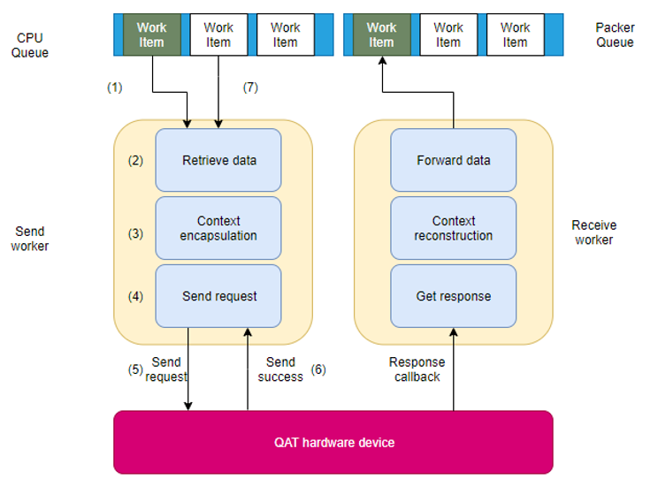
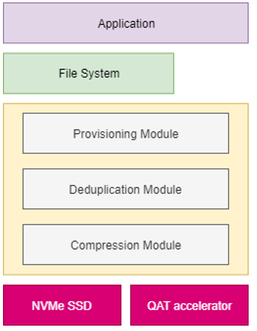

#### 12.24 汇报

---

##### 问题

* 换了CC的测试集以后，压缩率有提升，从90%到50%，但是没有体现在带宽性能上面，还是只有1400MB/s左右，相对于上面都不用的测试，提升性能依然不大
* 测试脚本的测试结果（循环测试）和单跑的测试结果有一定的对不上，需要继续跟进到底哪里出了问题
* 要在图里增加异步的表现，要增加更多的图（宏观一点的一张图）
  * 宏观的故事最好选择一个竖着的软件栈；但是故事讲的不要太远
  * 为什么工作要在block上面做？
  * 也有人在driver这里做压缩，对用户/上层透明，比如用户给数据过来，在SSD里面自己做压缩，然后用户读数据的时候SSD先做解压缩；支持更多应用更多场景
  * ATC会议的官网，胡小康的论文，Annual Technical Conference (很杂，系统相关都有)
  * FAST做存储相关的
* 大的框架/技术在整个链路里的图，同步异步对比的图，模块分离的图，数据分发处理的细节
* 插件的形式，让用户可以在同步和异步灵活切换
* 缺的数据
  * CC benchmark要做读数据，sequential read，random read，sequential write，random write
  * 测一组写数据，测一组读数据

##### 思路

* 只保证data receiver的异步，data sender这里还是要等收到OK才会继续的
* block layer全都在内核态
* NVMe 

##### 代码

* dataKVIO.c
  * void kvdoCompressDataVIO，这里是硬编码 kvdoCompressWorkWithQAT写进去的，可以通过改参数，很方便的实现选压缩算法
  * void kvdoCompressWorkWithQAT，这里直接返回了；如果是硬件的还行，如果软件的话有的返回就直接返回结果了，要合并一个简单的异步模型，给LZ4专门做一下；或者LZ4就不套异步了，kvdoCompressWorkWithLZ4就不管了
* vdoLoad.c，logicalZone.c，types.h，packer.c，recoveryJournal.c，slabJournal.c，hashZone.c，threadConfig.c，

##### 其他

* 问题
  * 跟LZ4比，性能差不多，但压缩比好两倍，CPU占用还少
  * 跟gzip比，压缩比差不多，性能好10倍
  * 在hot data和warm data上，压缩可能性能不好
  * 更优先推荐去重而不是压缩
* VDO的upstream先做掉，以QAT with async为基础，QAT with async multi主要是为了解决 Journal 瓶颈

* 图表配色：粉，蓝，橙，绿
* no-compress走vdo 1500左右，no-compress不走vdo 1800左右
* vdo-benchmark，问一下这个怎么测

