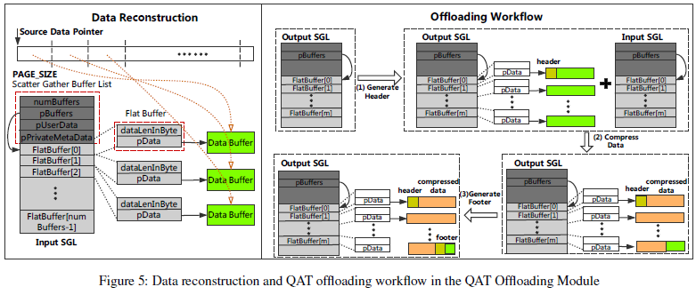

#### 2.19  ATC - QZFS

##### QZFS: QAT Accelerated Compression in File System for Application Agnostic and Cost Efficient Data Storage

---

##### Abstract

* data compression 关注 space efficiency 和 low TCO (total cost of ownership), I/O performance

* 现状：
  * 高compression rate且无损的压缩算法gzip，CPU占用太高
  * 可以用general-purpose hardware accelerator减轻workload，比如GPU, FPGA
* 本文：
  * ASIC-accelerated compression in file system (QAT-ASIC)
  * 性能：high-performance 和 cost-efficient 的数据存储
  * 用QAT优化zfs上的gzip算法，offload module，在file system层
  * 根据source data size，做了一个algorithm selector
  * 对IO操作，不需要extra memory copy，就能用QAT hardware
  * 性能：5倍 write throughput for FIO, 6倍 cost-efficiency 

---

##### Introduction

* 压缩是要减少data volume的storage space需求

  * save bandwidth，decrease r/w operation

* 无损压缩：data precision，information availability

* 前人工作：pipeline compression

  

* compression layer

  * application layer，most common
  * file system layer，ZFS/BTRFS
  * block layer，ZBD，RedHat VDO
  * 压缩做在底层，就上层都能获益；但因为在底层做，所以不影响上层数据，就要优化无损压缩算法gzip；application-agnostic

* ZFS的特点

  * combine file system and volume manager
  * 许多好的性能：data integrity, RAID-Z, copy-on-write, 加密，压缩

* QZFS offload了ZFS的压缩过程，并加了两个module来支持QAT

  * compression service engine module： 用来选压缩算法
  * QAT offloading module： 减少vectored IO model、地址翻译、memory map，重组ZFS data block，让QAT可以通过DMA访问这些block
  * 这样的module不需要大量memory copy，提供 overflow avoidance，load balance，fail recovery

* QZFS后端部署在Lustre集群，用 fio micro-benchmark测性能

  * fio 性能：5倍 write throughput，减少80% CPU资源消耗，减少95%CPU占用（现在20%以下）
  * 对比对象：software-implemented alternative

  * 实际的基因组数据post-processing workload：减少65.83%执行时间，减少75.58%CPU资源小号

---

##### Background and Motivation

* hardware-assisted compression

##### 2.1 Data Compression on Storage Devices

* NVMe SSD 可以显著提升r/w speed，low energy consumption
  * 问题在，limited capacity, high price，high TCO 维护成本
* 测试data compression的优越性
  * fio测试，gzip，LZ4和不压缩
  * gzip： high compression rate
  * LZ4： fast，high write throughput，因为压缩率不如gzip，所以dataset增大也会下降

##### 2.2 The Selection of Compression Algorithms

* algorithm指标，compression ratio, CPU resource consumption

* 用SAMtools来管理150GB的基因组数据
* 不同algorithm的执行时间：gzip确实是比较慢

##### 2.3 Hardware-Assisted Data Compression

* 在 cloud infrastructures 和 datacenter，都开始有越来越多的hardware accelerator 

* QAT已经集成到chipset中了
* 考虑到offload overhead和需要的preallocated system resource，并不会所有压缩都值得用QAT的，还是要分情况

---

##### System Design

* 架构图
  * 在ZIO module开始做修改：ZIO module把所有的IO request都抽象成ZIO处理，然后发给其他module；比如压缩和做checksum
  * ZIO_Compress Module做压缩
  * 新增的module，Compression Service Engine，QAT Offloading Module
* workflow
  * ZIO module把ZIO request发给压缩模块，传递configuration information给Compression Service Engine
  * Compression Service Engine选压缩算法
  * QAT Offloading module把request发给QAT，并收到反馈
  * 返回compress result data
  * 解压缩的工作流是类似的

* Compression Service Engine选压缩算法，QAT加速的gzip是默认，还有其他四种软件压缩方法，是gzip, LZ4, ZLE, LZJB；由用户选择，并对上提供uniform的接口
* 因为数据可能被映射到不连续的物理内存中，所以不能直接用QAT去DMA数据完成序列；这里做了一个vectored IO model，在不做memory copy的情况下，让QAT accelerator顺序的读到数据，或者把single data stream弄成multiple flat buffer

---

##### Implementation & Optimization

* QZFS是用QAT API和Linux环境开发的，被集成到了ZFS官方发行版

##### 4.1 Compression Service Engine

##### 4.1.1 Compressibility Dependent Offloading

* Low compressibility指没有压缩价值的数据；省不了很多空间，还要浪费资源和解压缩
* compressibility checker, 用auto-rejection method来判断是否要压缩
  * 这里给的标准是0.9的压缩率，也可以通过调整来放宽或缩紧
* 如果不压缩，Sres就置成原本的data

##### 4.1.2 Selective Offloading by Source Data Size

* source data size的大小是会影响system performance的
  * ZFS的参数 record size，指可以一次被压缩和被ZFS写的最大块，通常是128K，这就可以直接pack成一个ZIO request
  * 可选范围：4KB ~ 1MB
* 对于太小的source data，比如小于4KB，offload overhead就显得比较大了，这个时候选software compression比较合适
* 对于太大的source data，比如大于1MB，如果要做preallocate就需要很大块的kernel memory
* 所以这里QZFS只preallocate一块足够处理1MB的source data的kernel memory region，会有一个比较好的performance和比较低的consumption

##### 4.1.3 Applicability and Availability

* QZFS中的algorithm selector是被设计成一个centralized scheduler（集中调度程序）的，用一个恶algorithm vector，很容易选择
* 开发者只有底层实现好新的算法，加进algorithm vector就可以了
* 如果hardware accelerator出现runtime error，algorithm selector会无缝的切换到其他software的方法中去

##### 4.2 QAT Offloading Module

##### 4.2.1 Vectored IO Model

* QAT accelerator访问数据使用DMA的，要求存储在连续的物理内存
  * original source和ZIO request的result data 存的虚拟地址，用Psrc和Pdst表示

* vectored IO model是有效的实现连续内存DMA的工具
  * 通过两个buffer，flat buffer和scatter/gather buffer list (SGL) 来实现

* flat buffer有length和pData两个部分，pData指向一段连续物理内存

* SGL是用来管理flat buffer的

  * numberBuffers是flat buffer数量
  * pBuffers指向list中的第一个flat buffer
  * pUserData, 一个不可见的字段

  * pPrivateMetaData, buffer list的私有表示

* QAT accelerator可以通过解析SGL，获取每个flat buffer的物理内存beginning，然后通过DMA顺序访问每个data block

##### 4.2.2 Data Reconstruction and Memory Zero Copy

* naive 的数据充足就是分配块足够大的内存然后复制过去然后拼接
* 初步的方法：
  * 在compression offloading操作前，会分配一块连续物理内存，用来存从Psrc拷贝过去的片段，这些片段会通过ZIO request发给QAT
  * 同样的，还会有分配一块连续物理内存用来存QAT返回来的result data / response；也是通过ZIO
* 尽管初步的方法可以reuse分配的内存，但还是有overhead，在high speed IO的背景下，可能成为性能瓶颈
  * 解决：所以通过vectored IO model，加上虚拟地址翻译，memory map，就可以做到memory zero copy
  * QAT Offloading Module翻译ZIO request传过来的source data的虚拟地址，翻译成物理地址，然后通过DMA操作data block，放进Input SGL structure里

* physical page的映射
  * 实际数据在虚拟内存是连续的，在物理内存是隔断的
  * QAT Offloading Module把这些物理内存map到flat buffer中去，每个flat buffer最多放一个PAGE_SIZE
  * 虚拟地址的start和end可能是not align的，这里操作了一下align了
* Input SGL的操作方法和Output SGL是类似的
  * source data的虚拟内存可能来自不同的kernel memory zone，包括 vmalloc region 或者 direct memory region，分别对应`vmalloc_to_page`和`virt_to_page`两种方法，来获取虚拟内存对应的physical page structure

##### 4.2.3 QAT Offloading Organization

* Overflow avoidance and load balancing
  * 当QZFS boot up，QAT Offloading Module就会初始化一个QAT logical instance，用来存放request和response之类的东西
  * 接着，给QAT instance分配一块连续物理内存，里面有一个intermediate buffer，用来存放QAT accelerator的run time process data；差不多1MB大小
  * 虽然compress会缩小data size，但可能会带来额外的data expansion；所以intermediate buffer的大小被指定为 max allowed data size 的两倍
  * 如果data compress task太多，导致QAT的资源被占满了，module会做一些负载平衡，把一些task发给software的压缩方法去做
* Fail recovery
  * 可能session中会发生driver process crash的错误，比如DMA时
  * 这时，QAT Offloading Module会clean所有的session，把所有flag都设成FALSE，直到完成reset
* Offloading workflow
  * data reconstruction的过程：先拼header，再拼compressed data，最后拼footer
  * header是通过header generator API func生成的，需要output SGL做参数，是gzip style header；header会被放在output SGL的开头
  * data compression API把result data提交给output SGL；这个过程是用interrupt mode的，会wait到每个小task完成
  * 结尾是一个gzip compliant footer(兼容的)，通过footer generator API func生成

---

#### Evaluation

* data： FIO micro-benchmark, scientific big data

##### 5.1 Evaluation Methodology

* Experimental testbed 试验台

* Cluster
  * QZFS部署在Lustre分布式文件系统上; Lustre的本质是提供支持大量client的能力，但在这个实验里client的数量是limited的
  * 为了测试不同的Lustre环境，分成了single-node cluster, three-node-cluster, four-node cluster，分别担当client和OSS的职能（Object Storage Server)
  * 实验中，通过high-performance physical server和high speed NIC，构造出了heavy client，从而可以做压力测试，提供足够的stress
    * IO stress的来源有workload characteristic，client hardware limit（比如NIC limit），Lustre和OSS交互等
    * 我们预设每个client会产生100Mbps ~ 1Gbps的 IO stress

* Performance metrics 性能指标
  * 主要测三种情况：OFF, GZIP, QAT，其他的软件压缩方法比如LZ4, ZLE, LZJB也会测一测
  * 性能指标：
    * r/w throughput of micro-benchmark
    * average execution time of completing big data analytic task
    * compression ratio for indicating space efficiency
    * CPU utilization for indicating computing resource consumption（用Intel Performance Analysis Tool 采集数据）
  * 定义 compression-ratio / cpu-utilization 是衡量 cost-efficiency的指标，值约大表示效率越高；公式中不考虑QAT的cost是因为QAT device现在已经很便宜了

##### 5.2  Evaluation Benchmark

* Micro-benchmark workloads

  * fio（flexible IO tester）是Linux里面一种很有效的工具，可以模拟各种IO workload，精确测试IO性能
  * fio 可以生成若干thread或者process来测试r/w throughput；随机数据读写是默认设置好的
  * 这个实验里会调整IO pattern, block size, compress algorithm等参数，然后用fio来跑测试QZFS的性能

* ##### Scientific big data workloads

  * 3TB大小的基因数据，来源是European Nucleotide Archive, International Genome Sample Resource；这些数据用FastQ，BAM, SAM的那个方法做specific format，然后被用于企业和研究中
  * 对于每个client，会用SAMTools htslib，或Biobambam2 libmaus后处理过的数据，来作为computing workload
  * 我们从两个工具中挑选了5个有代表性的操作来衡量QZFS的性能
    * Converting, 转化数据，heavy CPU-bound task
    * Viewing，以指定的format print对应的information
    * Sorting，排序，创建临时文件来保存
    * Merging，合并，输出一个single sorted output file
    * Indexing，随机访问索引

##### 5.3 FIO Micro-benchmark

* FIO的实验是在four-node cluster的、16个FIO thread的、每个Lustre client处理两个Lustre OSS的，这样一个系统上做的；每个FIO thread的IO总量都是2GB；r/w throughput由两个client的数据的总和，CPU utilization是Lustre OSS的平均值

* Figure 7-a是研究不同的 IO pattern： SeqR, SeqW, RandR, RandW 
  * 纵坐标是throughput和cost-efficiency
  * 这个测试里fixed 128KB FIO block size
  * OFF的时候，读性能平均比写性能高18%，RandR最高，3937MB/s，OFF性能好主要是裸盘是NVMe SSD的性能好
  * GZIP的读性能比写性能高4.5倍，gzip的压缩和解压缩速度是不对称的 asymmetric
  * QAT的读写性能都是最好的，GZIP的压缩率和QAT差不多，但CPU resource consumption更多，compress time更长；QAT的写性能比GZIP提升了大约5倍；QAT对比OFF，吞吐量上升有限（10% r, 28% w), 但cost-efficiency上升大约3倍

* Figure 7-b是研究不同的block size
  * 这是在调整workload的比例为SeqR : SeqW = 1 : 1，然后研究block size的影响
  * record size只是表示可以直接被ZFS compress和write的block的大小，因为可以切分，所以实际上测试的范围是4KB ~ 1MB
  * OFF情况，block size更大可以充分发挥NVMe SSD裸盘性能的优势，从1899 MB/s 提升到 3213 MB/s，大概有70%的提升
  * GZIP和QAT的情况，FIO block size的修改没有很明显的影响IO throughput，但QAT依然有最高的性能
  * 值得注意的是，4KB block size时，QAT/GZIP的cost-efficiency都是最高的，这可能是由record size的值和FIO random data的reuse共同导致的；如果有徐国4KB的block，他们更有可能被压缩后，形成一个新的block（指压缩率大于50%的情况）
* Figure 7-c是研究不同的compress algorithm： LZ4, LZJB, ZLE, QAT
  * QAT的throughput，在SeqW平均要高12.71%，在SeqR平均要高4.83%
  * QAT的cost-efficiency，在SeqW平均要高2.25倍，在SeqR平均要高1.62倍
  * 这种优势的来源是gzip算法本身的高压缩率，以及QAT offload了gzip algorithm提升了速度，共同带来的
  * 相对来讲，SeqR的cost-efficiency会比SeqW普遍高一点，这是因为解压缩一般比压缩会消耗更少的计算资源
* 在整个FIO测试中，在用QAT的情况下，两个heavy client servers上的平均负载是超过4000 MB/s的，大概是32~320个普通client的水平（100 Mbps ~ 1Gbps）

#####  5.4 Scientific Big Data Evaluation

* 在Lustre client上运行的workload是和Lustre OSS来交互，从而获取存储的scientific data的
* 我们使用了两种部署模式：shared deployment mode (single-node cluster)，separate deployment mode (three-node cluster and four-node cluster)

##### 5.4.1 Shared Deployment Mode

* 有八个scientific workload process在shared server上并行运行，每个process处理9.5 GB的数据，总共76 GB

* 先分析QAT-accelerated gzip比起普通gzip的优势，如Figure 8
  * decompression process, 包括read compressed data，解压缩，write uncompressed data三部分
  * converting process，包括read uncompressed data, write new format data back
  * 五个测试的converting process都差不多，大概161.12s ，decompression process 就差很多，这体现了accelerator相对core的优越性
  * QZFS总的执行时间就156.71s, 因为QZFS直接从storage读取compressed data，且decompression process和converting process是一起做的，这就使得性能很好
* application确实可以集成compression module，但这要对application做很多的修改，相比之下，在file system做compress在扩展性上就会方便很多

* Figure 9-a 是在每个scientific workload process中，不同数量线程去做sorting操作，表现出的execution time和cost-efficiency
  * 只有一个thread的时候，GZIP执行时间426s，cost-efficiency为6.6；QAT的执行时间快30%，cost-efficiency高10倍
  * 随着thread数逐渐增加，并行性提高，GZIP和QAT的执行时间都是下降的，16个thread的执行时间相对1个thread，有30%~60%的提升；但CPU utilization是会上升的，QAT从5.8%上升到12.2%，GZIP从64%上升到83%

* Figure 9-b 是评估不同的后处理workload类型的影响
  * 五种操作都要共去storage做read操作的，除了viewing，其他四种还要做write操作
  * 对于converting和merging两个write操作比较多的workload，相比GZIP，QAT各减少了73%和63%的执行时间；对于其他操作，也大约有2倍的性能提升
  * 在cost-efficiency方面，QAT带来了3.91倍的性能提升，在sorting操作中是5.57倍
* 在整个shared deployment测试中，在用QAT的情况下，两个heavy client servers上的平均负载大约2143 MB/s的，大概是17~171个普通client的水平（100 Mbps ~ 1Gbps）

##### 5.4.2 Separate Deployment Mode

* 我们把client的数量从一个提升到了两个，分别执行r/w 9.5 GB的workload

* Figure 10-a 是three-node cluster的实验结果
  * QAT平均减少了63.10%的执行时间，cost-efficiency平均提升了6倍
  * 与shared mode类似，这里也是converting的执行时间提升最大，减少了68.95%
  * 在viewing操作中，QAT提升了最高的9.11倍，这是因为viewing不需要做写操作，就省去了一些QAT带来的overhead

* Figure 10-b 是four-node cluster的实验结果
  * QAT平均减少了63.14%的执行时间，cost-efficiency平均提升了6.26倍
  * 这也证明了QZFS具有很好的scalability
* 在整个separated deployment测试中，在用QAT的情况下，两个heavy client servers上的平均负载大约2000 MB/s的，大概是16~160个普通client的水平（100 Mbps ~ 1Gbps）

---

##### Bottleneck Analysis

* hardware device limit分析

  * 从Figure 7-a来看，这里QAT的最高throughput是4680 MB/s，两个OSS的CPU utilization大概在20.2%，表明计算资源是有富余的
  * 压缩率是3.55，所以NVMe SSD实际上的IO throughput是1318 MB/s，但OFF状态能跑到3314 MB/s，所以NVMe SSD这个硬件设备也不是瓶颈
  * 因为是两个OSS，network throughput是2340 MB/s = 18.72 Gpbs，只有NIC网卡的最大带宽40 GbE的一半
  * 每个Lustre OSS中的QAT compression throughput也是18.72 Gbps，达到DH8950 QAT card limit的80%

  * 综上所述，4680 MB/s的IO throughput并没有达到任何hardware设备的limit，而且即使再用更多的thread并行做RandW，也跑不满

* 实际上的bottleneck在ZFS software stack
  * ZFS的设计是面向multi-core的，但ZFS能够被QAT offload的operation是受限的，这是受到CPU core的数量和available QAT instance的数量的限制
  * 另外，worker thread和QAT的交互是synchronous mode，需要wait
  * 所以即使增加测试的FIO thread，也无法再提高性能了
* 想要克服这个bottleneck，需要优化worker thread和QAT的交互方式
  * QAT本来就是有提供non-blocking的request/response interface的；如果把offloading mode改成async的，让single worker可以有能力同时把multiple compression operation都offload给QAT，就可以突破瓶颈
  * 但这个工作比较困难，涉及ZFS对async mode的支持，和需要有一种efficient的pause-and-resumption工具；这会被作为future work

---

##### Related Work

* Hardware-assisted data compression technique
  * GPU, LZSS, FPGA, LZ77

---

##### Conclusions

* High storage IO performance 和 low Total Cost of Ownership是一组tradeoff；data compression是一组比较有效的方式同时完成这两个目标，能读更多的数据，throughput会高，用QAT的话，CPU占用也少