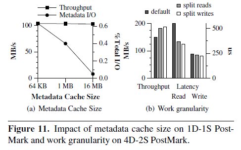

#### 2.22 论文阅读

##### Using Transparent Compression to Improve SSD-based I/O Caches

---

##### Abstract

* Flash-based SSD提供了比hard disk更好的性能，SSD的一个主要用途是在IO path中作为cache；这篇文章将研究一种透明的transparent、在线的online IO compression技术，从而增大SSD-based cache的容量，从而提高性能
* 平台用的是FlaZ，一种在block-level的IO system，对file system透明
  * 为了在维持高性能的情况下引入transparent、online IO compression，FlaZ提供了variable-size blocks, mapping of logical to physical blocks, block allocation, cleanup
  * FlaZ把compression和decompression迁移到multicore CPU，从而减少overhead

* 我们在Linux kernel实现了FlaZ，用multicore CPU在一个商品服务器上评估性能，使用了TPC-H，PostMark，SPECsfs等workload

* 实验结果显示，compressed caching可以用CPU cycle来换取IO performance，就是时间换空间；还可以提升SSD efficiency，分别是99%、25%、11%

---

##### Introduction

* SSD有减轻/迁移IO overhead的潜力：
  * SSD有low read response，响应快，不受seek的影响；
  * SSD的峰值throughput比HDD高很多；
  * 不过，虽然SSD的容量在增大，但短期内到不了HDD那种cost per GB
* 因此，IO 层次化会涉及到SSD和HDD，且能够提高SSD的cost-efficiency的技术，都是值得研究的。有两种典型思路：
  * 使用multi-level cell的SSD，即MLC，就是一个NAND cell可以存 2个bit，对应的是SLC；
  * 在IO path中使用transparent online data compression，减少数据存储所需要的空间（本文的思路）
* 在file-level做compression的缺点，也是导向block-level compression的motivation
  * 尽管这也减少了存储数据的空间，但强加了一些限制；file-level compression是file-system、OS specific的，限制了在IO path中做compression
  * file-system通常不知道physical storage device的属性，比如在RAID controller中
  * 现在file-system的数量很多，在file-level做压缩增加了复杂度

* 我们开发了FlaZ，在IO path中用SSD做compressed cache
  * SSD的地址空间对应用不可见；
  * FlaZ用SSD的一部分指定的partition，在main memory和SSD之间做透明的压缩/解压缩；
  * 数据存在SSD中都是compressed的，给file-system都是uncompressed的，DRAM中不做cache
  * FlaZ这种设计是很灵活的，在任何file-system和storage device的IO path中都可以使用
  * 这篇文章只针对SSD，HDD online compression没有做

* **FlaZ有两个layer**，一个做transparent compression，一个把SSD用作IO cache
  * **FlaZ caching layer：** direct-mapped，write-through，one block per cache line
  * **FlaZ compression layer**
    * variable block size： 压缩后大小不一样，要存size metadata
    * logical to physical block mapping： logical到physical的映射是many-to-one的，要提供低开销的策略，还要scale底层的device和block allocation策略，不能影响data layout
    * increased number of I/Os： 做压缩会增加IO，尤其是写操作，要read-before-write，先读compressed data
    * device aging： 用作compress的SSD盘的寿命和碎片化问题，让allocate 新的physical block和利用locality变困难，预测底层device的性能也变得困难
* 除了IO相关的挑战，compression algorithm本身也有overhead；随着core增加，这种overhead会scale down。这提供了对未来的思路
  * 用更好的IO速度来隐藏compression overhead
  * 定制配有提升energy和performance的accelerator的CPU
  * 把compression overhead offload到其他storage controller上去
* TPC-H，PostMark，SPECsfs等是workload
  * 提高了SSD efficiency，99%，25%，11%
  * 但也提高了CPU utilization，大概4.5倍
  * 降低了response time，大约15%

---

##### System Design

* FlaZ拦截IO request，对上层（file-system，database）提供block device的抽象，方法是提供连续的logical block地址空间
* 数据在FlaZ/SSD cache中是compressed的，在hard disk中是uncompressed的

##### 2.1 SSD Caching

* SSD cache对比DRAM cache的优势
  * SSD是persistent的，不会有warm-up overhead；通常SSD的容量也更大
  * block mapping policy的影响，比如direct-mapped和fully-set-association，DRAM用有的用全相联，是因为容量小，用全相联减少conflict，SSD就可以用简单的map策略，也可以做到没有很多conflict

* 图1介绍了FlaZ如何拦截IO request，和如何处理

  * 每个logical block都对应到相应的SSD cache block
  * 读操作时，caching layer检查cached block是否valid，如果是（cache hit）就转交给compression layer，如果不是（cache miss）就去hard disk拿
  * cache miss的情况下，read operation在hard disk读取后就结束了，之后会有一个异步的SSD cache fill过程
  * 写操作时，HDD和SSD都有涉及。write through策略在hit的时候做update，miss的时候做eviction，都会修改；在eviction时，要把valid位置为否
* cache layer中一些策略决定的原因
  * 使用direct-map的原因：最小化metadata的量，并且不会增加很多overhead；如果用全相联，metadata会增加，进而占用SSD的容量
  * 使用write-through的原因：不用像write-back一样需要阶段性的sync metadata；同时，write back会降低系统弹性，如果SSD failure，就会造成data loss
* metadata的存储策略
  * FlaZ把所有cache metadata存在了HDD beginning，因此metadata的写就和SSD性能无关
  * 为减少metadata IO，在DRAM中也有cache metadata，一些metadata update也会直接做在DRAM里
  * 目前，FlaZ每GB数据只有2.5 MB的metadata

##### 2.2 Compression in the IO path

* compression操作的执行步骤
  * 初始化workspace，通常是256 KB
  * 把input压缩后放进output buffer，用分片的方式 piece-wise
  * output buffer完成后，compression就完成了
* FlaZ使用了LZW compression算法，也可以根据block content选用其他的算法；实现中还有两种可替代的算法：zlib和lzo

* compression发生在写操作，比较heavy，需要向write IO buffer做一个memory copy（拷贝compressed data）
* decompression发生在读操作，比较light，直接把read data放进read IO buffer，不需要对uncompressed data做拷贝

* block-level compression看似是简单的，它仅仅是做拦截intercepting；但实现起来是需要下面这些特性的

##### 2.2.1 Mapping logical blocks to extents

* 压缩会使得fixed-size logical block变成variable size segment；这些不同长度的segment都被存在叫做extent的fix-size physical unit，这个大小是block的若干倍
* FlaZ有两种map策略来定位存在extent中的compressed block
  * logical to physcial translation table
  * 嵌入在extent中的linked list

* logical to physcial translation table
  * 每个logical block对应两个field：extent ID，一个存储各种flag的field
  * 这个table存在每个compressed block device的开头，用logical block number来索引
* extent的结构如图2
  * 开头有两个point，分别指向first block和free space；first bock point用在读操作的时候遍历；free space都是连续的，放在extent的末尾，用在写操作的时候add
  * 每个block后面都跟着一个header，包括next block number，compress size，compressed data等信息
  * 写操作时，新添加的block是会放在list的开头的，如图2，这是为了避免两个很close的write operation使用同一块extent；这会更新first block point
  * 读操作时，是要拿到这个block的lastest write，也就是list中最先匹配到的
  * 理论上讲，遍历的时间和block number成正比，但实际上，因为遍历是in-memory操作，没有那么慢 
  * 假设compression平均能节省40%的空间，per-block header只会占用0.6%，overhead很小
* 如果data block无法压缩，就会直接存进extent中；这个extent其实类似log-structure file system的设计；统计来说，只有2%的workload是无法压缩的

##### 2.2.2 Block allocation and immutable physical blocks 

* physical block的大小是不可变的，但logical block压缩后的大小是不一致的；思路是根据压缩后的大小放到合适的physical block里去，相对来说用larger extent会方便很多，形成像是LFS的机制；和LFS的区别在，并不总是需要extent在底层storage是连续的
* 用不可变的physical大小是有好处的，因为不用拷贝到memory中再做修改
* 一段时间后一些extent的block会过期，当free extent的数量低于某个阈值，FlaZ会触发一个cleaner process来释放空间

##### 2.2.3 Extent Buffering

* 为了降低compression带来的“read-modify-write”机制（写操作IO数量增多变慢），减少read IO数量，FlaZ的compression layer把一些extent buffer到了DRAM中去
* extent buffer是一个全相联的data buffer，实现方法是有collision list的hash table，采用LRU eviction策略
  * hash table的key是ID；分配到bucket的hash策略是根据extent中的free space数量来决定的
  * 每个bucket是一个extent的LIFO queue；直到extent “reasonably” full，这个extent会一直在extent buffer中
  * 系统参数：extent size，number of buckets，total size of extent buffer
  * extent size会影响碎片化程度和局部性
    * large extent局部性差，在应用随机写的时候，相邻的extent可能都是无关的
    * small extent碎片化严重
* extent buffer的两个精细化设计
  * 一个trade off：extent age会影响到data locality，如果extent一直在buffer中，局部性会下降；但如果extent的eviction太快，会增加碎片化
    * 解决方案：设计一个aging timeout，表示extent可以在buffer中存在的最长时间
  * 将compressed data并发写入extent buffer时，从局部性的角度看，是要考虑并发写入的block，是要写入同一个extent还是不同extent的
    * 这里也有一个trade off：锁竞争（不同extent好） 和 memory copy的CPU overhead（相同extent好）
  * 实验表明，buffer很小一部分的extent就足够维持局部性了；一旦extent满了，就会立刻往device中write back（physical block）

##### 2.2.4 Extent cleaning

* FlaZ维护两个extent pool：completely empty和not empty。当只剩一点点empty extent的时候就需要cleanup process；为了减少和application的交互，FlaZ把cleanup process从common path中移除了
* FlaZ cleaner的工作流程：
  * 当free extent pool降低到阈值一下，调用cleaner；cleaner会利用map和extent header遍历SSD上的physical extent，通过验证map中每个logical block确实是指向这个extent中的block的，来确认extent中的block是否live
  * 然后将live block复制到新的extent，更新logical to physical map，并把clean过的extent加进free extent pool；这个过程不需要压缩/解压缩，只要复制到新的extent就可以了；当free extent的数量超过某个阈值，clean工作就结束
  * cleaner需要的meatdata只有一个，last scanned extent，记录上次清理到哪里了；这个指针不需要持久化，这只是给cleaner的一个hint

* 考虑FlaZ cleaner的性能：
  * cleaner产生的read IO数量和scanned extent数量成正比，write IO数量和live block数量成正比
  * 为提升cleaner性能，采取一个first-fit，decreasing-size packing的策略
    * 用贪心策略减少将variable-size block放进fixed-size extent时的空间浪费，large block尽可能少占用extent数，small block尽可能在边角填满
    * 如果不这样做，所有的live block都会按照被scan的顺序重定向，碎片化会很严重
  * 考虑空间局部性的问题，extent的重定向会使原本相邻的block可能会被放到不同的extent去；为了减少这种影响，将cleaner每次scan的大小限制在2MB，这个大小既能有效减少对空间局部性的影响，也为重组算法提供了足够的logical block大小

* cleaner做placement decision的时候，需要考虑的事情：在cleanup的时候哪个logical block应该被放进哪个extent；正在做压缩logical block是reuse当前的logical block，还是用free pool中新的extent
  * FlaZ通过压缩的时候将相邻的logical block放到同一个extent里，来维持logical block的原本的“接近” origin proximity
  * 所以正在做压缩logical block会reuse当前的logical block，而不是用新的block；这样可以在SSD上尽量少做改动
* log-structure的写策略（list，header），和cleaner策略，消除了原本写操作中必经的“read-modify-write”的执行顺序，提升了一点性能，推迟空间回收
  * 另一种策略是compress multiple block，扩大存储和压缩的粒度，比如64 KB的chunk当做single unit；但这样做对small-size IO支持就会变差，局部性也不好，每次随机写都需要对整个unit做解压缩，粒度太大了

* 总的来说，我们期望cleanup的过程不很显式地影响应用的IO请求
  * 之后会试着量化当cleaner和application并行时的性能
  * 后面的实验数据是在cleaner disabled的情况下测出来的

##### 2.2.5 I/O concurrency

* 现代存储系统有很大程度的IO并行；并行对transparent compression也很重要，可以通过overlap减少compression latency和CPU overhead

  * 为了支持高程度的异步，FlaZ用callack handle来代替kernel call的同步策略
  * FlaZ也在extent上支持multiple reader和multiple writer 
    * 把compressed block放进extent有两步：首先在extent中pre-allocated所需的free space，然后拷贝block
    * multiple writer时，会同时将block拷贝到同一个extent中去，这要求pre-allocation时的space mangement要做好

* 但高程度的IO并行对FlaZ的局部性是有负面影响的

  * 在write path中，block做完压缩后要写进extent
  * 通常为了维持良好的局部性，同一个request涉及的block都会放在相同的或者相邻的extent中，这是一个atomic mapping operating，是由一些同步操作来保证的
  * 并行时，extent中的space allocation是顺序的，但处理logical block时是parallel的

*  除了highly concurrent IO stream带来的影响，FlaZ要对large IO做处理

  * 为了减少compression对large IO的影响，FlaZ用multiple CPU core来处理single large IO
    * 写操作会batch，因为buffer-cache flushing的策略
    * 但large IO的读操作可能出现低并发，解压缩的response time上升的现象

  * FlaZ的每个thread用两个work queue，一个做read一个做write，read work queue有更高的优先级
  * 将large IO切分成独立的block unit，然后放在不同的CPU core上做压缩和解压缩
    * 这也降低了读写操作的response time，降低了写操作可能带来的延迟

  * 我们发现通过global的read queue/write queue做调度，对所有FlaZ thread和所有IO size都是有效的

* 解压缩是在IO read读SSD cache和extent被读进memory之后再做的
  * 解压缩的步骤也可能可以提前一点，在extent的read callback已经在bottom-half时就开始解压缩，降低context switch的次数
  * 但bottom-half的执行和top-half是在同一个CPU context执行的，这会限制并行性
  * 我们通过使用separate thread来解决这个问题，这个thread专门做解压缩

---

##### Experimental Methodology

* 测试平台和环境：Linux，CPU，cache，RAM，storage controller，disk，SSD，HDD

* 在测试中使用了三个benchmark：TPC-H，PostMark，SPECsfs
  * TPC-H有两组系统配置，1HDD-1SSD, 8HDD-2SSD
  * PostMark也是两组系统配置，1HDD-1SSD, 8HDD-4SSD
  * SPECsfs是一组配置，8HDD-2SSD
  * 用多个HDD或者SSD时会被配置成RAID-0阵列，通常是4-1,2-1,1-1这样的比例，是目前比较常见的配置
  * 实验都跑在250 GB的HDD分区上
  * 我们并没有用write-only的workload，因为SSD cache这种实现的优势在read IO上比较突出

##### 3.1 TPC-H

* TPC-H是一个数据仓库benchmark，包含一系列database的查询；它的写操作很少，主要是更新文件访问时间戳和一些control operation

##### 3.2 PostMark

* PostMark是一个合成的、文件系统benchmark，它会通过持续修改文件来模拟e-mail服务器，并测试事务吞吐量
* 事务包括：create/delete file operation，read/append fileoperation；事务类型和针对的文件是随机的

##### 3.3 SPECsfs

* SPECsfs模拟NFSv3/CIFS服务器的operation，实验中使用CIFS protocol
* 每秒钟会生成一个表示CIFS operation的performance task，每个operation需要120 MB的disk空间
* SPECsfs会记录 每秒处理的operation数 和 operation的平均response time

---

##### Experimental Results

* 对比对象：compression on SSD cache，uncompressed caching, HDD (no SSD caching)

##### 4.1 TPC-H

* 图7比较了compressed SSD cache和HDD的性能
  * 当workload和cache不太匹配（25%/50%的数据在cache中），及cache hit比较低时，如图7-a，compression cache能减少execution time，比uncompressed cache性能好；压缩提高了cache大小，从而提高了性能
  * 但图7-c也表示，compression cache会随着cache hit增高，CPU占用率越来越高，相对uncompressed cache提高29%、65%、101%，但总体依然低于25%
  * 当workload和cache 100%匹配时，相比uncompressed cache，compression cache性能下降40%，因为这个时候没有额外的cache hit红利了
* 图7-b是8HDD-2SSD的配置
  * hit ratio和CPU utilization和1HDD-1SSD基本一致
  * 在medium cache，compression性能比uncompressed好47%；但在small cache和large cache，性能分别下降7%和36%
    * small cache性能下降是因为解压缩的response time影响变大
    * large cache性能下降是因为没有cache hit红利

##### 4.2 PostMark

* 图3表示1HDD-1SSD配置下的测试数据
  * 如图3-a，在throughput上，compression比uncompressed提升20%，比native提升44%；吞吐量上升有两个原因
    * 图3-b表示compression可以提高cache hit ratio
    * PostMark是写操作占主导的benchmark，compressed cache这种log-structure write的形式能够很好地提升SSD write的性能
  * 图3-c表示compression会使得CPU占用从uncompressed的20%上升到40%

* 图4表示8HDD-4SSD配置下的测试数据
  * hit ratio的趋势和1HDD-1SSD时是类似的
  * 图4-a表示uncompressed在2GB的小cache时会有16%的吞吐量下降，到16GB的大cache时会有8%的吞吐来那个上升；compression则一直有一个6%~15%的吞吐量下降
  * 图4-b表示从CPU占用来看，decompression的overhead难以因为IO overlap消除；而且compression相对decompression CPU利用率上升了3.5倍
    * 因为SSD本身的read IO response time就很低，decompression带来的lantency相对交大，会成为瓶颈

* 图5是为研究如何在PostMark获得好一点的性能，这里用了4个PostMark concurrent instance
  * 在这个实验里FlaZ的性能稍微提升了一些；图5-a表示compression的吞吐量比uncompressed高1%-18%，只有在32GB的cache size下低3%
  * 图5-b表示，在64GB cache size下，FlaZ消耗了86%的CPU

##### 4.3 SPECsfs

* 图6表示8HDD-2SSD配置下的测试数据
  * cache compression的性能优势主要体现在small cache的情况，在4GB cache的时候，compression有更高的46%的cache hit ratio，吞吐量比uncompressed有11%的提升；随着cache size增大，compression的cache hit ratio优势就渐渐没有了
  * 图6-c表示在4GB和16GB cache size的情况下，compression能降低11%和14%的延迟，其他两个测试下基本一致
  * 在所有测试下，CPU占用都上升了25%，但依然低于10%，因为SPECsfs有许多small random write，这让HDD成为了性能瓶颈，而不是CPU或者SSD

##### 4.4 Extent Size

* 在之前的所有测试里，extent size用的都是32KB；在FlaZ中，extent size会影响IO read volume，fragmentation，placement
  * 通常来说，small extent size的空间局部性不好
* 图8-a表示TPC-H的性能随extent size的变化图；
  * 32KB的extent size性能最好，execution time最低；
  * 相比更小的extent size，32KB时虽然IO traffic上升，但依然有29%的性能提升；而相比更大的extent size，则是更多受到IO read traffic的负面影响，256KB extent size的IO read traffic是32KB的4倍
  * 为了控制变量，所有的working set都被置入SSD cache（即hit ratio 100%）
  * 我们只使用Q14，因为Q3和Q11相对来说对extent size的变化更不敏感

* 图8-b测试的是4 instances，8HDD-2SSD的PostMark
  * 在128-512KB的extent size时吞吐量性能最好，64KB时只差了2%
  * 更大的extent size会降低碎片化，从而降低IO write traffic
  * 32KB的时候达到了最小的IO read traffic；太小的extent（小于16KB）局部性不好，太大的extent（超过128KB）会使extent中有许多unrelated block
  * 综合read和write的情况，extent size取32-64KB比较合适

##### 4.5 Effect of cleanup on performance

* 图9表示当执行clean策略时benchmark测试的性能
  * 这个测试中使用PostMark的2HDD-1SSD配置，workload和compressed cache比较匹配
  * 为了更清晰的测试cleaner的影响，我们测了设置free extent为10%和20%的两组数据
  * 结果是，在图9中，200s-280s和315s-390s形成了两段低谷；当clean process在运行时，性能下降了一半，吞吐量平均下降了123.5 MB/s
  * cleaner限制了SSD的峰值throughput，因为在clenaer工作时有大量的seque，ntial read和少量的sequential write，会降低很多性能
* 在一些主流的存储系统中，会有IO空间周期这样一个概念，会有一段操作间隔
  * 在这类系统上，cleaner可以在间隔中运行，不会很明显的影响性能
  * 但cleaner想在这类系统上运行仍然需要future work去适配

##### 4.6 Compression Efficiency

* 前面讨论过，在block-level做压缩是为了获得更好的compression efficiency
  * block-level的压缩会对data和file-system metadata都做压缩，而file-level的压缩只会对data做压缩
* 表3表示不同不同类型的数据在三种不同level层做压缩的情况下的compression ratio
  * 在所有的case中，在应用层做压缩能够取得最好的compression ratio
  * 大多数情况下，block-level的压缩率（FlaZ）会比file-level稍微好一点，zlib的优势会比lzo更大，压缩率更好

* 接着研究不同的compression lib对性能的影响，特别是对CPU utilization的影响，因为CPU utilization会影响hit time和hit ratio
  * 表2显示，lzo的压缩速度比zlib快3倍-5倍，但压缩率上lzo比zlib差37%的性能
  * 我们用PostMark的1HDD-1SSD配置做实验，分别准备当用zlib时能够fit workload的cache size，和当用lzo时能fit workload的cache size；如图10所示

* 图10-a表示尽管zlib的压缩率性能好30%-50%，它的CPU占用还是会更高，这抵消了压缩率好的优势，在1HDD-1SSD的配置下，和lzo相比只能少量的提升性能
  * 总的来说，当lzo的SSD cache小30%的时候，zlib才能和lzo达到差不得性能
* 在8HDD-4SSD配置时，zlib的吞吐量性能比lzo差40%

##### 4.7 Metadata Cache Size

* 目前的SSD和DRAM的capacity ratio（容量比）还是允许FlaZ把所有需要的metadata都放在DRAM中的；但随着SSD容量增大，会面临扩展性的问题
  * 因此，需要实现一个metadata cache用作通用用途；这是个全相联的cache，用collision list的hash table，和LRU eviction策略实现
  * metadata cache的大小会影响额外增加的IO数量
* 图11-a表示在PostMark的1HDD-1SSD配置下cache size对性能的影响
  * 随着metadata cache size增大，吞吐量性能没有明显改变，cache size小造成的额外的IO数量不到应用程序流量的1%
  * 因此在FlaZ中，小容量的cache size够用了

##### 4.8 Compression Granularity

* 图11-b表示job granularity和r/w优先级的影响
  * PostMark是对read latency敏感的
  * 增加large read IO的并发，会使latency降低50%，也会提高20%的吞吐量
  * 如果继续做split write，还会降低7%的latency

---

##### Discussion

* 接下来，关于FlaZ还有五个要考虑的点	
  * 存放metadata所需要的DRAM
  * 在shutdown或system failure之后，cache如何保持持久化
  * size随时间变化的compressed device的容量，是如何呈现给上层的
  * FTL和wear-leveling损耗问题
  * power efficiency

##### 5.1 Metadata memory footprint

* Problem: the amount of DRAM required for metadata purposes

* FlaZ对metadata的需求是2.31 MB per GB，其中caching layer需要880 KB，compression layer需要1.25 MB
  * metadata footprint的大小是随SSD cache size变化的，而不是随底层的HDD大小变化；所以DRAM需要分给metadata的容量也不是很大；
  * 同时，large cache-line size也会减少metadata footprint
  * 最后，尽管DRAM可以cache metadata来减少额外的IO，但对于今天的DRAM和SSD容量来说，这已经不是必须要做的优化了

##### 5.2 SSD cache persistence

* Problem: how the cache remains persistent after a normal shutdown or system failure
* 传统的block-level system并不更新IO path中的metadata，而只会更新configuration，这只会导致很少量的同步IO
  * 在我们这个系统中，metadata consistency并不是一个必要项；就比如在system failure之后，并不要求SSD cache metadata做一个持久化
  * 在一次unclean shutdown之后，FlaZ会视为发生了failure，然后再次从cold cache开始
  * 所有数据都会在hard disk中有lastest copy
* 如果SSD cache经历了failure要求做同步IO保证metadata的一致性，这会导致在common path中降低性能
  * 在FlaZ中，我们会在failure之后直接从cold cache重新开始，以降低common path上的开销

##### 5.3 Variable compressed device size

* Problem: how the capacity of a compressed device whose size varies over time is presented to higher layer

* space-saving技术通常是data-dependence的，而且会随时间变化
  * 通常在做transparent online compression时，都是需要制定一个specific size的，这个过程要在application访问之前做好
  * 尽管一些os可以支持动态resize device，但并不是所有file-system和application都支持这样做
  * FlaZ创建device后，它名义上的size是由higher layer提供的，是actual size的一个倍数；这样做超额预定是有缺点的，如果最后compression和预计的大小有冲突，application可能会看到write error或者有剩余的device space是unused的，而这种情况应该是通常发生的
* 另一个可选的策略是在一开始就声明它的nominal device size为actual size，如果没用完就这样，如果满了，那physical device中剩下的没放进去的内容，会被放到一个新的device中去，允许application使用FlaZ省下来的空间
  * 但这有个问题是，这可能会导致计算出不同的compression ratio；以及需要给device申请更多空间的这个操作
  * 这需要一种支持multiple fixed-size logical block device的技术，有点像搭一个free storage pool，这应该是以后block-level storage system的一个必须要攻破的难关 

##### 5.4 FTL and wear-leveling

* Problem: FTL (flash translation layer) and wear-leveling issue

* 本篇文章研究了如何使用compression layer和SSD本身的特性，来extend SSD capacity
  * 目前的SSD controller并不会暴露任何底层信息，我们依靠FTL来解决wear-leveling
  * 我们不能直接影响FTL block allocation和re-mapping策略
  * 目前的实现策略尽可能的在避免small random write
* 以一种和SSD FTL协作的方式来设计block-level driver和file-system是一种重要的方向

##### 5.5 Pow efficiency

* Problem: power efficiency
* 用CPU cycle来换SSD capacity（做cache），其实也会影响到power efficiency
  * 更多的CPU cycle去做压缩解压缩了，power consumption会上去
  * 比较高的SSD cache hit rate也会提升IO power consumption
  * 这个其实在用CPU cycle换IO性能的时候是要考虑的

---

##### Related Work

---

##### Conclusions

* 本篇文章介绍了transparent compression如何在IO path中提高SSD caching的性能
* 我们开发了FlaZ，一种介于memory和cache之间的SSD cache，并且用compressed data对它坐压缩；compression是online做的，是在common path里，也会侧面提升SSD cache的容量

* 文章在处理variable size compressed block，logical to physical block map/allocation，compression and IO overhead上，花了很大的心思；用于测试的benchmark workload分别是TPC-H, PostMark，SPECsfs
* 我们发现对available SSD capacity，即使做很小的优化也能提升IO性能，transparent block-level compression就提高了SSD的有效容量，代价是提升了CPU utilization
* 尽管block-level compression很复杂，但我们也通过讨论论证了data compression是一种未来的提升IO性能的趋势

