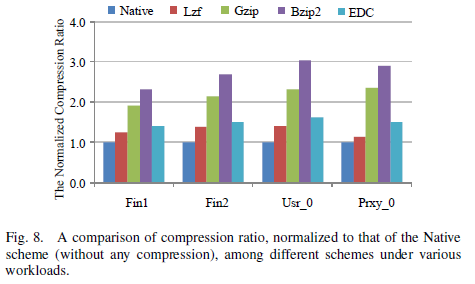

#### 2.27 论文阅读 EDC

##### Elastic Data Compression with Improved Performance and Space Efficiency for Flash-based Storage Systems

----

##### Abstract

* Data compression，可以通过减少write traffic和space需求，可以提高 flash-based storage system的space efficiency和reliability；但作为代价，也引入了IO path上的overhead
* 现有的flash存储上的data compression机制对所有的workload都是用固定的算法，没有识别data pattern和diversity，所以这里有个优化点

* 这篇文章提出了EDC
  * 对于可压缩的data，根据workload的多样性，使用不同的压缩算法，比如，在CPU utilization较低的情况下使用high compression ratio的算法，在CPU utilization较高的情况下使用low compression ratio的算法
  * 对于不可压缩的data或压缩率很低，EDC会直接将它们写入flash
* 实验表明，EDC在我们搭建的轻量级平台上，能够节省38.7%的storage space，平均33.7%；另外，EDC优化了固定压缩算法的IO性能，最高优化61.4%，平均36.7%

---

##### Introduction

* IO越来越成为big data analytics的瓶颈；flash-based SSD有替代HDD的趋势；许多大公司都开始使用inline data compression techniques

  * 第一个趋势，flash的发展主要在提高NAND flash device的storage density，从SLC到MLC甚至TLC，但因为有cell erase limit，在保证latency依然不变的情况下，这会降低芯片的耐久度

  * 第二个趋势，主要是提升处理器的处理性能，比如GPU或者multi-core processor，都可以显著降低计算开销

* 综合两种趋势，flash里做compression也成为了一种趋势，有如下原因
  * 通过compression可以提升space efficiency，因为可以存储更多的data了，从而提升process power
  * 可以减少NAND flash cell的erase次数，延长使用实名
  * 通过compression，减小单个request的size，从而降低latency
* 以往研究表明，data的可压缩性分布是倾斜的，这主要和data compression的机理有关，只和data block的subset有关
  * 通过分析大数据发现，50%的data chunk提供了86%的可压缩度，31%的data chunk是几乎不可压缩的
  * 我们自己的分析发现，不同的file type有不同的可压缩度

* 共识的是，不同的压缩算法有不同的compression ratio和compute overhead
  * 高压缩率的算法需要更高的compute overhead
  * 真实workload的pattern显示，系统high utilization 和 little/no load，这两种情况是会交替出现的
* 原本实现方法（所有数据都用fix的压缩算法）的缺点
  * 在CPU high utilization的情况下使用高压缩率算法，导致性能下降
  * 对不可压缩的数据倾斜算力，导致系统资源浪费，性能下降

* EDC的主要策略
  * 对于可压缩的data，根据workload的多样性，使用不同的压缩算法，比如，在CPU utilization较低的情况下使用high compression ratio的算法，在CPU utilization较高的情况下使用low compression ratio的算法
  * 对于不可压缩的data或压缩率很低，EDC会直接将它们写入flash

* 验证EDC有效性的方法是通过在一个轻量级的EDC平台上，做广泛的trace-driven evaluation；实验结果表情EDC优化了performance和space efficiency的tradeoff，提高了性能

---

##### Background and Motivation

* 分析SSD的两个特性；data format和type与可压缩性的关系，典型压缩算法的compression efficiency

##### 2.1 Flash-based SSD

* flash-based SSD是用硅质memory chip做成的，没有moving part（HDD的悬臂），有high energy-efficiency和high random-write performance
* SSD的读写性能不平衡，写性能和读性能的差距是成数量级的，必要的GC也会降低IO performance
  * SSD的原理是，写一块64-128 KB的flash block之前要先做erase才能rewrite，这个过程通常是毫秒级的
  * 在没有足够的free space时就会触发GC，所以GC的频率和SSD的写的data总量是成正比的，这会影响性能
  * 目前的研究，通过data compression和data deduplication，减少SSD上写的data总量，来优化性能
* SSD的response time会随着request size线性增长
  * 我们使用IOmeter tool测试SSD在不同request size下的性能，基本是线性增长的
  * 这是因为无论读还是写，都是完全由电子线路实现的，包括control和data，所以request size越大，data transmission时间越长，就会影响response time

* SSD的这两个特性表明，通过data compression减小write request size，从而提高写性能，是可行的；更少的写操作，既能提高性能，也能提高耐久

##### 2.2 Data compressibility and compression efficiency

* 无损压缩可以显著的减小data size，但TIF，JPEG, video and sound file等都是基本不可压缩的，因为它们本来就已经是compressed format；对这些类型的data做压缩会浪费资源，还会提高IO response time，因为压缩过程目前是在IO critical path上的

* 不同的压缩算法有不同的压缩率和压缩/解压缩速度
  * 图2使用的是两种类型的file，Linux source file和Mozilla Firefox file
  * 通常来说，high compression ratio的算法会是slow speed的，比如Bzip2和Gzip
  * Lzf和Lz4的压缩率低，但压缩速度快

##### 2.3 Workload characteristics

* 研究者分析过storage IO path上的workload，发现burstiness和idleness是普遍存在的（爆发和平缓）
  * 图3测试了Storage Performance Council上的financial workload，和Microsoft Research Cambridge上的enterprise workload
  * workload访问IO的密度，可能突然很高，也可能长时间平缓
  * 在上层优化（DRAM buffer或者IO scheduling）的作用下，IO看起来时常处于较低的水平，实际上可能经常是爆发性的，且会随着时间聚集

* data compression可以减小data size来提升efficiency，但也会带来compression/decompression的overhead
  * 近期实验在flash和NVM-based storage system上测试data compression的各种性能，包括performance，space efficiency，reliability
  * 因为high CPU utilization的压缩算法和bursty IO workload的可能重叠，使得data compression的性能没有达到预期
  * 因此，在所有workload和所有time时都是用high compression ratio的压缩算法是不合理的，需要有一个更灵活的data compression scheme

---

##### Elastic data compression

* 介绍EDC system的大纲，解释具体的架构和设计细节

##### 3.1 The design objectives of EDC

* 设计目标主要有三个：system performance, space efficiency, system reliability

  * system performance：在系统经历bursty period，以及遇到non-compressible data时做相应处理，在不显著牺牲space efficiency的条件下提升performance

  * space efficiency： 在系统经历idle period时使用高压缩率的压缩算法，在不降低performance的条件下提升space efficiency
  * system reliability： 通过data compression减少stored data amount和write traffic，减少SSD erase次数，延长寿命

##### 3.2 EDC architecture

* 图4是EDC在storage subsystem和IO path上的架构
  * EDC设计在block device level，在file system下层；这使得将EDC纳入现有的file system比较容易（比如Ext4和F2FS）；同时，EDC直接与底层flash-based storage system交互，可以是single SSD，SSD-based disk array或者一系列pure flash chip

* EDC有三个主要模块：Workload Monitor, Data Compression & Decompression Engine，Request Distributer
  * Workload Monitor检测应用传来的IO access，判断request type和data compressibility，计算IO intensity
    * IO intensity通过 IO access per second（IOPS) 来衡量
  * Data Compression & Decompression Engine： 负责write操作时压缩，read操作时解压缩
    * 根据Workload Monitor提供的三个参数，模块会选择合适的压缩算法，或者选择不压缩
  * Request Distributer： 与device和Data Compression & Decompression Engine交互，发送处理好的数据并接受request

##### 3.3 Data structure

* EDC是block-level compression，处理上层应用传来的 fixed-size input data block，但压缩过后大小就都不一样了，因此有必要track post-compression data block，并且在pre-compression和post-compression的data block中做映射

* 图5表示EDC的数据结构，表示compressed data是如何被存储的
  * 包括3个重要的参数：LBA, size, Tag
  * Tag是一个3 bit的参数，用来标记对应的压缩算法，000指不压缩
  * LBA是整个compressed data block的logical beginning address
  * size是整个compressed data block的size
* flash translation layer（FTL）的操作是这样的：使用out-of-place scheme，update和overwrite只会让旧的block invalidate，而不会rewrite，updated data会被写到新的flash block

* 为了解决allocated space不够的问题，EDC制定了75%，50%，25%的三条线
  * 如果compressed block大于原先size的75%，就把data视为non-compressible，就减少碎片化

##### 3.4 Workload monitor

* 图6表示IO intensity的探测对于EDC选择适合的压缩算法是重要的
  * 不仅要考虑IOPS（IO access per second），还要考虑request size，这两者一起决定flash storage system 的IO intensity（IO bandwidth requirement）
  * EDC中，衡量IO intensity使用4KB request per second，记作 calculated IOPS，large request会算作多个4KB request；4KB是Linux的默认page size
  * calculated IOPS，既能考虑IO intensity，也考虑了data compression带来的latency
* 通过calculated IOPS，EDC选择最合适的压缩算法，对于各种算法都有对应的阈值/范围对应；如果IO intensity超出了calculated IOPS设定的最大阈值，EDC也会跳过compression阶段，争取最好的性能
* 另外，除了IO intensity，data compressibility也会影响压缩算法选择
  * EDC用了很简单的抽样方法，如果抽中的data stream是可压缩的，EDC就会对整个做data compression
* data compressibility影响要不要做压缩，IO intensity影响用哪个算法

##### 3.5 Data compression and decompression

* 除了之前的讨论结果，还有一个新的结论：对于总量相等的data，个数少的large data block的解压缩，会比个数多的small data block要快
  * 因此，EDC会把sequential write data block合并成一个大的来提升性能
  * 现实中write request很少单个/少量到来 sparsely，大部分会是in burst的；所以当收到write data block立刻做压缩，可能会失去combine的机会，如图7-a

* EDC用Sequentiality Detector (SD) 来解决这个问题
  * 要点是尽可能多的detect and merge连续的write request；这会在收到read request或不连续的write request的时候断掉，这个工作由SD来做
  * 在等待combine的时候，前面的write request是在wait的
  * SD形成的数据流如图7-b所示
* 在收到read request要做解压缩时
  * 如果之前压缩过，就根据Tag选择算法来解压缩，然后返给上层应用
  * 如果数据没有压缩，就直接返回
  * 即使解压缩会在read path上有compute overhead，但并没有增加response time；这是因为stored data size因为压缩减小了，减少了read的时间，可以盖掉解压缩带来的overhead；同时，解压缩本身就必压缩快很多

---

##### Performance Evaluation 

* 首先描述测试方式和平台，接着通过trace-driven测试EDC平台的性能

##### 4.1 Evaluation setup and methodology

* Experimental platform

* Evaluation baselines
  * 测试中，我们将EDC和不做任何data compression的Native，和使用fixed compression algorithm的Lzf，Gzip，Bzip2一同作比较
  * 我们通过压缩率来评价space efficiency，通过average response time来评价performance
  * 因为EDC的设计目标有平衡space efficiency和performance，我们将 compression-ratio/response-time也作为一个指标（越高越好）
* Workload and compression characteristics
  * 实验用的测试trace是来自Storage Performance Council和Microsoft Research Cambridge
    * 两个financial trace是手机OLTP application上的数据，记作Fin1和Fin2
    * 另外两个enterprise trace是从storage volume收集来的，记作Usr0和Prxy0
  * 这些trace有不同的read/write ratio，不同的IOPS和average request size，如表2
  * 因为这些trace里没有实际内容，我们用SDGen scheme来手机真实应用中的data sample，从而分析compression characteristics
    * SDGen create的数据不仅compression ratio不同，它还能模仿诸如compression time，heterogeneity（非均质性）等其他对data compression来说比较重要的系统性能指标
    * SDGen的信息可以从和Github上找到

##### 4.2 Performance results

* 图8表示不同trace不同algorithm下的compression ratio
  * 压缩率排名都是，Bzip2，Gzip，EDC, Lzf，Native；EDC的平均压缩率是1.5
  * 高压缩率会带来高access latency，尤其是在IO-intensive period；而且压缩率并不是compression based storage system要考虑的最主要因素

* 图9的纵坐标是ratio/time，考察的是平衡space efficiency和performance
  * 这种情况下，fixed compression大都比Native还低，尤其在Fin1和Fin2；这是因为fixed compression scheme只考虑压缩率，忽略了其他涉及，导致整体性能下降
  * EDC除了在Fin2中不如Native，其他trace都都比Native更好

* 图10比较的是response time
  * Bzip2的access latency都是最高的，最差甚至有Native的9.76倍，这已经无法接受了，就如图2所示，Bzip2的压缩/解压缩速度跟flash-based SSD比起来实在太慢了，会导致很多user request在IO queue中wait；Gzip的趋势跟Bzip2比起来是类似的
  * 相比之下，Lzf的性能就跟Native差的不多，在Usr0中还比Native更好；因为data compression减小了request size，从而减少了spend time

* 很容易发现EDC的表现是最好的
  * 与Lzf相比，在response time上，最高在Fin1中优化了61.4%，平均是36.7%
  * 与Gzip和Bzip2相比，在response time上，分别平均提升2.1倍和4.9倍

* single SSD可能不能满足企业级storage system的performance、capacity、reliability要求，实验又搭建了RAID再做一系列测试
  * 图11表示，用RAID测试的整体趋势和single SSD是一致的

* EDC中有一个重要参数是IOPS阈值，这是用来选择合适的压缩算法的
  * 图12表示在Fin2 trace中，修改IOPS阈值测试EDC的性能，横坐标是使用Gzip算法的比例
  * 我们可以看到，随着Gzip使用比例增大，压缩率提高，但response time增加更快；因此，Gzip的合适使用比例就是20%左右，可以比较好的平衡performance和space efficiency
  * 这个参数对于不同的系统来说，是应该根据情况修改的

---

##### Related Work

---

#####  Conclusion