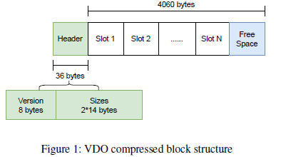
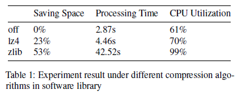
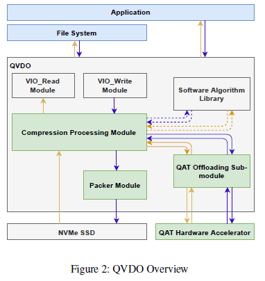
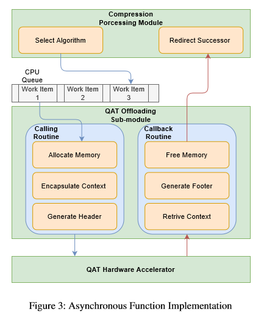

#### 2.28 论文阅读 QVDO

QVDO: QAT Accelerated Compression in Block Layer for File System Agnostic Storage

---

##### Abstract

---

##### Introduction

* 尽管hard drive的成本下降，这也补偿不了big data对带宽和存储的需求；因此data reduction technology会越来越重要
* 可以做data compression的level
  * 通常做在application layer；较高层做数据压缩有更多的信息（文件类型等，底层看都是block），可以有更好的性能，但这也存在限制
  * 较高层做压缩要求OS和file system是支持的，这减少了存储技术的可选范围；子系统也需要支持特殊的file system，但为了支持数据压缩去修改也是很困难的
  * 在较低层做数据压缩，比如block device layer，兼容file system specific compression就很容易
  * 比如read-only device的Cloop和CBD，read-write device的VDO和ZBD
* 数据压缩算法可以分为有损压缩和无损压缩
  * 尽管有损压缩发展很快，但无损压缩的应用field显然更大
  * 具有高压缩率的无损压缩通常会消耗可观的计算资源，为了缓解，hardware accelerator assisted compression成为选择，比如一些general propose hardware如GPU,FPGA
  * ASIC (Application Specific Integrated Circuit) 专用集成电路因为其效率和性能的优势受到关注，如Intel QuickAssist Technology和AHA Products Group of Comtech EF Data
    Corporation；ASIC效率更好的原因是它包含了software和general-purpose processor不能轻松实现的specialize logic

* QVDO是在VDO中集成QAT
  * QAT是一个用于计算密集型操作的硬件加速解决方案，可以提高云、网络、大数据和存储应用程序中的安全性和压缩性能
  * VDO是一种开源的块虚拟化技术，使用块设备作为备份存储，提供透明的压缩和重复数据删除层
  * QVDO，作为一个块层压缩解决方案，提供透明的文件系统不可知的压缩和高效的能源消耗比
    * 设置QAT offloading module，把compression offload到QAT上，用hardware zlib实现低CPU资源消耗，高吞吐和高压缩率
    * QVDO重构了整个压缩流程，包括使用异步机制，来配合hardware本身具备的异步特性
    * 实现同时考虑memory allocation、async function details、ensuring performance和safety；并且在压缩完成后，对write workflow也有优化，把packing procedure放到了multiple threads上执行，而不是single non-scalable thread

---

##### Background

##### 2.1 Block storage and compression

* block-level compression不受限于文件系统，它在写操作写入磁盘之前，或读操作从磁盘读取之后，使用压缩模块拦截IO path

* 这和upper-level compression有一点不同：variable output size和fixed block size和不匹配的，要做特殊处理；先前的研究主要是通过combine小的compressed block

  * VDO提供了block packing来固定压缩输出的大小，如图1，可以把来自不同输入数据块的几个压缩结果放到同一个output block中去
  * 尽管这样做对系统来说实现很方便，但碎片化是不能忽略的；如果数据的可压缩性不好，或者压缩算法的压缩率不高，都会效果不好（极端例子，4KB压缩到2.01KB，需要large padding，导致实际的压缩率又变回1）

  * 高压缩率算法在block-level compression中是不可替代的，尤其是在block packing的情境下

##### 2.2 Lossless compression algorithm

* block-level compression对上提供透明的无损压缩，用计算资源换磁盘空间；高压缩率低CPU占用的算法显然是最优解，但这对software algorithm来说做不到
* 我们比较两种无损压缩算法的性能： LZ4和zlib
  * LZ4属于LZ77家族，压缩解压缩的速度更快
  * zlib属于DEFLATE算法，是LZ77和Haffman编码的结合
  * VDO只提供了LZ4算法，我们实现了zlib来看看性能

* 如表1所示，zlib压缩率更高，但processing time特别长，并且CPU占用率为99%
  * 这会导致严重的race，并且影响同一个系统中的其他compute-bounded task
  * 因此在VDO中使用zlib是不能接受的

##### 2.3 Hardware-assisted compression

* 目前，各种硬件加速器的发展已经证明了它们有加速computed-bound workload的能力
  * ASIC比FPGA和GPU好主要是好在高性能和更高的性能消耗比
  * QAT的功能：通过硬件加速提供 高效的加密和压缩性能 服务

* 硬件压缩和软件压缩的不同
  * latency和throughput性能
  * 信息交互机制：
    * 软件没必要去做诸如把压缩分成几个task这样的交互优化，因为CPU就是用来做计算的
    * 硬件的系统交互和软件不太一样，通过DMA做memory allocation很高效且安全；且硬件有异步的function call来减少latency增加throughput
    * 异步的一些重要参数：accelerator instance number, next workflow module

---

##### Design

* QVDO的主要架构图

* 沿着IO path来看QVDO的执行过程

  * 上层传来一个bio request，VDO将其抽象成DataVIO
  * 在准备工作做好后，会执行read或write request，由VIO_read模块和VIO_write模块完成

  * 主要的修改在compression processing module
    * 选择压缩算法，与其他module交互比如packer module，保留消息通知机制
  * 新的模块，QAT offloading sub-module，把压缩逻辑offload到QAT
* write path的执行过程

  * 在deduplication module做完后才开始write path；如果data block没有做deduplication，它也会进入VIO_write module，然后先做compression processing module
  * 压缩模块中，会检查QVDO系统的压缩能力，注册callback function，选择合适的压缩算法；callback function会把compressed data发给packer module
  * 为了和QVDO底层交互，DataVIO会转化成另一个结构DataKVIO，然后task被若干个分开独立做压缩的CPU thread分摊
    * 每个thread都在做一些compute-bounded的task，比如compress和hash
    * DataKVIO被视为CPU queue中等待的一个work item，CPU queue是一个FIFO队列；之前的module会选择对应的CPU queue然后放进去
  * Compressing processing module会把item压进queue，选择压缩算法（包括QAT和software）
  * QAT offloading sub-module把request发给QAT硬件加速器，并获取返回
  * 当compressed data放进DataKVIO，会被发到packer module，发送是通过在compression processing module中注册的回调；packer会把一些small block data拼进一个4KB大小的data block
  * compressed data在被pack后，会理科被写入底层存储，或等待flush指令
* read path的执行过程
  * 当接收到read request，如果是data在compressed block里，request会发给底层存储；然后access 4KB block，把结果发给compressing processing module；完整的data block包含若干compressed fragment，可能只有一部分是实际要操作的部分
  * compressing processing module会选择对应的解压缩算法，然后把解压缩当做work item放进CPU queue中去
    * block head中有存mapping state，这里放了对应compressed fragment的position和length
  * 最后，compressed fragment的small piece会作为输入依次发给QAT offloading module，然后输出4KB data发给VIO_Read module

* QAT offloading sub-module的执行
  * 管理QAT compression instance，在workload中与其他module交互
  * 虽然QAT这种ACID hardware可以加速压缩的执行时间，但时间还是相对比较长的；不过，compression work item是在CPU queue中wait然后等待polling的，直到上一个work完成才会handle下一个
  * 这里的wait是不高效的，并没有完全发挥出QAT的性能，因此我们在这里做了async mechanism的优化，把执行过程分为两个部分：sending 和 receiving
    * 当sending过程一结束，work item就会被标记为finish，work queue中的下一个work item就会被poll到
    * receiving part会等待QAT hardware的回调，然后继续之前的workflow
    * context data会被保存并随着workflow一起发送

---

##### Implementation & Optimization

* 实现比较容易，使用QAT kernel API，只有2000行左右

##### 4.1 Compression processing module

* 此module的功能
  * 在write workflow中，compression processing module从VIO_write module获取work item，检查可压缩性，判断是否需要在work item处理完以后做flush
  * 在read workflow中，接收一个full 4KB read block；如果data之前没有被压缩，在read workflow中不会经过compression processing module的
* 总结来讲有两点功能：选择压缩算法，设置后续module的回调
  * algorithm selector根据初始化的配置选择压缩算法；无论是hardware还是software的方案，都会有一个independent function运行在对应的CPU core上
  * 每个CPU queue都是FIFO数据结构，是附属于某个CPU core的，所以CPU密集型的函数（compress和hash），都是在这个特殊的core上执行的
    * software的方案的实现都是同步的，计算密集型的work都由CPU自己来做，然后将计算结果发给下一个process module
    * hardware的方案更复杂一些，包括凉饿physical device之间的通信，在QAT做完压缩工作后，compression processing module会redirect到下一个module（write workflow中是packer，read workflow中是VIO_read）
* 目前，software和hardware的算法都是可选的，这基于静态配置；我们实现了一个脚本，可以收集每种配置的performance result，并告知用户最佳的配置
  * future work里，这可以分析之前的test data来建立训练模型，分析QVDO的配置

##### 4.2 QAT offloading sub-module

##### 4.2.1 Memory allocation

* 对QAT硬件加速器来说，data block被存在连续的物理内存中，是通过DMA访问的
  * QVDO的input data是用virtual memory pointer来存的，存成DataKVIO中的dataBlock，result data存成scratchBlock
  * 对解压缩过程来说，input data是compressed data，是dataBlock中的一部分
  * QVDO提供了两种data buffer结构，flat buffer和scatter/gather buffer list（SGL），来有效的合并不连续的虚拟内存（具体参见FlaZ）
    * flat buffer: dataLenInByte, pData
    * SGL: header(numBuffer, pBuffers, pUserData, pPrivateMetadata)
* 由于input data block都是fix成4KB的，解压缩的output data也是4KB，大多数情况下一个flat buffer已经足够了；但在一些特殊情况下，比如数据的可压缩性很差，比如jpg，data compression可能反而会增大size
  * 为了处理这种情况，会提供一个reserved flat buffer，numBuffer在压缩的时候设成2
  * 由于申请的内存直到不被使用才会被free，memory free operation目前是放在结束后的callback里的

##### 4.2.2 Asynchronous function implementation

* 在发给QAT的数据里，还有一个保存着context的结构，QATCallbackTag，包含3个variable field和4个memory pointer
  * dc_direction, 记录QAT hardware是做压缩还是解压缩，不只是选算法，也会影响接下来的执行过程
  * dc_inst_num, 用于这个compression request的instance number，这个值的取值范围有QAT hardware来决定，QAT中有这个参数并行上限的限制
  * dc_result，获取request result，比如produced/consumed data size
  * memory pointer，包含两个buffer list pointer，两个metadata buffer pointer，在hardware processing中会用到，在callback routine中被free
* QAT API本身就是支持sync和async两种模式的，在从input buffer获取data，和生成/组装compressed result data 到output buffer时，都是有两种的
  * 为支持async，QVDO提供了一个calling routine和一个callback routine来和QAT hardware交互
  * calling routine只负责将数据发给hardware accelerator, 不受waiting period的影响；
    * 这里获取从compression processing module那里发来的数据，是DataKVIO的格式; 从DataKVIO的解析中，可以获取到compression direction，并且知道是否需要申请多的reserved memory
    * calling routine还负责flat buffer和SGL的memory allocation，和QATCallbackTag的准备
    * dc_Inst_num也是在calling routine配置的，通过一种类似round robin的原子操作，来对hardware instance做load balance
    * 为了后面做压缩，这里还会调用header API来生成zlib style header，大小是2 byte；compressed data的三个部分，header，data，footer，都是由同一个instance来生成的
    * 在解压缩阶段，header会被跳过，hardware accelerator会直接从content data开始
    * 在data和context都准备好以后，QAT kernel API会调用compression function，会传递包含QATCallbackTag的一个DataVIO参数
    * 一旦数据成功的发给QAT accelerator，calling routine的工作就完成了，它会直接返回到compression processing module，准备access CPU queue中的下一个work item并开始一个新的sending work
    * 如果向hardware accelerator send request时产生了error，这个request会被标记为不可压缩data，然后在calling routine结束前，为它申请的memory都会被提前free
  * QAT accelerator中用的callback function也是在初始化的时候register的，在hardware完成task的时候会被调用，它有两个参数p_callback和status
    * p_callback指向callback parameter，status指hardware做compression的过程是否成功
    * callback routine中，会生成不含QATCallbackTag的DataKVIO结构，但依然是有包含在这个compression request中，指向next module的callback function的
    * 在调用callback routine后，dc_direction会用来判断这是write workflow还是read workflow
    * 在write workflow中，会先判断产生的compressed result是不是有留足够的space给footer；header，produced compressed data, footer，是要一起被拼进4KB大小的block中去的
    * 这里会调用一个footer API，生成zlib style footer，从QATCallbackTag中u后去dc_inst_num, 使用和header/content相同的instance去生成
    * 如果这时候没有足够的size给footer了，数据会被标记为不可压缩数据，然后接下来会直接跳到finial step
    * 在read workflow中，如果status不成功，readBlock中的status属性会标记这是invalid fragment，表示read request failure；failure发生的情况不多，如果发生的话会直接导致read workflow结束
  * 任何一个阶段中如果status是not success，或者所有步骤都结束了，就会进入final step
    * final step负责释放allocated memory的空间，并给compression processing module发item，来redirect successor module
    * 在write workflow中，compression是一个中间步骤，若干个compressed data会被packed进single block
    * 预留给overflow的flat buffer也会被释放，这个work item会被压入下雨给module的queue中去，就是packer module的packer queue
    * 然后会调用刚进入compression processing module时注册的回调函数
    * 在read workflow中，基本是类似的，但解压缩已经基本是workflow的结尾了
    * 当从compressed fragment中获取了original data，DataKVIO中readBlock的一个callback 会被调用，将data发给下一个procedure；即负责将uncompressed data发给发read request的user bio 这样一个过程

##### 4.2.3 Scalable thread configuration

* VDO提供了multi-tread kernel driver来做性能调优，可以通过多个同时的IO request把资源开销平摊到multi thread上

  * 最优的情况是当最后一个work完成时，新的work item已经在这个thread的queue中wait，表明没有空闲的thread等待request
  * 比起其他的scalable thread，packer thread是设计成non-scalable的，只负责在VDO device中packer数据结构

* QVDO做了multi packer的优化，避免work item都聚集在single packer queue

  * packer的callback function是在QAT offloading module的callback routine中被调用的，会通过一个简单的hash操作，选择对应的packer，并访问packer queue中的work item
  * 每个packer都对应一个thread以及thread queue，这些thread是一起被初始化的；这些thread是在separated core上运行的，这样有更好的性能

  * packer的workflow中，有一个并行的packing算法，通识处理multiple的compressed fragment；这个算法会将best-fit的compressed fragment拼进一个4KB的block中去

  * block的中间结构 (intermediate block) 会按照remaining space排序，从fullest到empty，然后incoming的compressed fragment会一个一个试过去，直到可以被插入（贪心算法）
  * 当一个intermediate block “unlike”（看起来）没办法在容纳更多compressed fragment时，一个bio write request会把这packer好的block发给底层存储，然后这个intermediate block会被clear然后reuse
  * 判定intermediate block无法容纳更多compressed block是有一个时间的阈值的，在阈值过后仍然没有新插入的fragment，就判定不能再容纳了；阈值是在初始化的时候一起设置的

* QVDO中，每个packer有一个nextPacker的属性，指向遍历list的下一个zone，这个zone是用来在packer中发送flush operation的

  * 这个notification会发给第一个packer，increase flush生成计数器，然后开始flush operation，然后通知下一个packer（packer和zone交替）
  * flush生成计数器是用来不再等待coming data block
  * flush operation会强制把非空的intermediate block写入底层存储
  * 当list中没有packer在等待时，notification processing procedure就结束，传入的DataVIO会包含新version的生成计数器

---

##### Evaluation

---

##### Related Work

---

##### Conclusion

