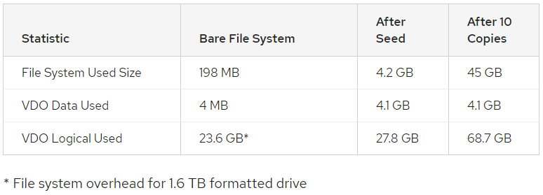

#### 2.4 VDO阅读笔记

---

```
https://access.redhat.com/documentation/en-us/red_hat_enterprise_linux/7/html/storage_administration_guide/vdo-ev-data-testing
```

##### 30.3 Data Efficiency Testing Procedures

* VDO的successful validation需要遵循一个结构良好的test procedure

##### Test Environment

* test cases对test environment的需求
  * 可以使用多个Linux physical block device
  * target block device (/dev/sdb) 要比 512GB 大
  * Flexible IO Tester (fio) 版本2.1.1
  * 安装了VDO
* 每次测试开始时应该记录以下信息确保充分了解测试环境
  * Linux build number, kernel build number
  * 通过 `rpm -qa` 获取installed package list
  * 完整的系统规格
    * CPU数量和类型，在`/proc/cpuinfo`中
    * installed memory 和 available memory (在运行基本OS之后)，在`proc/meminfo`中
    * driver controller的类型
    * disk的类型和数量
  * 正在运行的process list，通过`ps aux`查看
  * 为了和VDO一起用create出来的Physical Volume和Volume Group的name，在`pvs`和`vgs`中
  * 格式化VDO Volume时所使用的file system
  * 挂载目的的权限
  * `/etc/vdoconfyaml`的内容
  * VDO文件的位置
* 通过运行`sosreport`就可以获取所需要的大部分信息

##### Workloads

* 有效地测试VDO需要使用模拟真实世界工作负载的数据集。数据集应该在 可以去重压缩的数据 和 不能在不同条件下展示性能的数据 之间提供一个平衡。

* 有几种工具可以综合生成具有可重复特征的数据。特别推荐在测试期间使用两个实用程序VDbench和fio。

* 本指南使用了fio

（待续）

---

##### 30.3.1 Configuring a VDO Test Volume

##### Create a VDO Volume with a Logical Size of 1TB on a 512GB Physical Volume

```
[ Create a VDO volume ]

#1. 可以通过writePolicy控制同步存储上层的模式，async和sync两个模式
vdo create --name=vdo0 --device=/dev/sdb --vdoLogicalSize=1T --writePolicy=async --verbose

#2. 用XFS或ext4文件系统来format新的device
mkfs.xfs -K /dev/mapper/vdo0
mkfs.ext4 -E nodiscard /dev/mapper/vdo0

#3. 挂载formated device
mkdir /mnt/VDOVolume
mount /dev/mapper/vdo0 /mnt/VDOVolume && chmod a+rwx /mnt/VDOVolume
```

---

##### 30.3.2 Testing VDO Efficiency

##### Test Reading and Writing to the VDO Volume

```
first file: /mnt/VDOVolume/testile
second file: /home/user/testfile
third file: /mnt/VDOVolume/testfile2

#1. 写32GB的随机数据到VDO Volume中去
dd if=/dev/urandom of=/mnt/VDOVolume/testfile bs=4096 count=8388608

#2. 从VDO Volume中读取数据，并写到不在之前的VDO Volume上的另一个地方去，成为second file
dd -f=/mnt/VDOVolume/testile of=/home/user/testfile bs=4096

#3. 对之前两次写入的数据做diff，应该显示是一样的
diff -s /mnt/VDOVolume/testfile /home/user/testfile

#4. 拷贝一份second file，成为third file
dd -if=/home/user/testfile of=/mnt/VDOVolume/testfile2 bs=4096

#5. 对之前两次的数据做diff，应该显示是一样的
diff -s /mnt/VDOVolume/testfile2 /home/user/testfile
```

---

##### Remove the VDO Volume

```
#1. 卸载在VDO Volume上创建的文件系统
umount /mnt/VDOVolume

#2. 从系统中把名为vdo0的VDO Volume移除
vdo remove --name=vdo0

#3. 确认volume被移除
vdo list --all | grep vdo
```

---

##### Measure Dedeplications

```
#1. 通过30.3.1 Configure a VDO Test Volume的方法，创建并挂载VDO Volume

#2. 在名为vdo1~vdo10的VDO Volume上创建10个目录，来保存测试数据集的10个副本
mkdir /mnt/VDOVolume/vdo{01..10}

#3. 根据文件系统检查磁盘空间的使用量
df -h /mnt/VDOVolume
Filesystem            Size  Used Avail Use% Mounted on
/dev/mapper/vdo0      1.5T  198M  1.4T   1% /mnt/VDOVolume

#4. 运行以下命令并记录值。Data blocks used是物理设备上用户数据使用的block数，Logical blocks used是优化之前使用的块数，将被用作测量的起点
vdostats --verbose | grep "blocks used"
data blocks used                : 1090
overhead blocks used            : 538846
logical blocks used             : 6059434

#5. 在VDO Volume上层创建一个data source file
dd if=/dev/urandom of=/mnt/VDOVolume/sourcefile bs=4096 count=1048576
4294967296 bytes (4.3 GB) copied, 540.538 s, 7.9 MB/s

#6. 重新检查正在使用的物理磁盘空间，应该会增加刚刚写的文件对应的块数量
df -h /mnt/VDOVolume
Filesystem            Size  Used Avail Use% Mounted on
/dev/mapper/vdo0      1.5T  4.2G  1.4T   1% /mnt/VDOVolume

vdostats --verbose | grep "blocks used"

data blocks used                : 1050093 (increased by 4GB)
overhead blocks used            : 538846 (Did not change)
logical blocks used             : 7108036 (increased by 4GB)

#7. 把文件复制到10个子目录
for i in {01..10}; do
	cp /mnt/VDOVolume/sourcefile /mnt/VDOVolume/vdo$i
done

#8. 再次检查所使用的物理磁盘空间(使用的数据块)的数量。这个数字应该与上面步骤6的结果相似，只是由于文件系统日志记录和元数据略有增加
df -h /mnt/VDOVolume
Filesystem            Size  Used Avail Use% Mounted on
/dev/mapper/vdo0      1.5T   45G  1.3T   4% /mnt/VDOVolume

vdostats --verbose | grep "blocks used"
data blocks used                : 1050836 (increased by 3M)
overhead blocks used            : 538846
logical blocks used             : 17594127 (increased by 41G)

#9. 从写入测试数据之前找到的值中减去文件系统使用的空间的这个新值。从文件系统的角度来看，这是这个测试所消耗的空间量。

#10. 观察记录的统计数字中节省的空间
```



---

##### Measure Compression

```
#1. 创建至少10GB物理和逻辑大小的VDO卷。添加选项来禁用deduplicate和启用compression
vdo create --name=vdo0 --device=/dev/sdb --vdoLogicalSize=10G --verbose --deduplication=disabled --compression=enabled

#2. 在transfer之前检查VDO统计数据;注意所使用的data blocks和logical blocks used(均为零)
vdostats --verbose | grep "blocks used"

#3. 用XFS或ext4文件系统来format新的device
mkfs.xfs -K /dev/mapper/vdo0
mkfs.ext4 -E nodiscard /dev/mapper/vdo0

#4. 挂载formated device
mkdir /mnt/VDOVolume
mount /dev/mapper/vdo0 /mnt/VDOVolume && chmod a+rwx /mnt/VDOVolume

#5. 同步VDO卷以完成所有unfinished的压缩
sync && dmsetup message vdo0 0 sync-dedupe

#6. 再次检查VDO统计数据。使用的逻辑块——使用的数据块是仅为文件系统压缩保存的4 KB块的数量。VDO优化文件系统开销和实际用户数据
vdostats --verbose | grep "blocks used"

#7. 将/lib的内容复制到VDO卷。记录total size
cp -vR /lib /mnt/VDOVolume
...
sent 152508960 bytes  received 60448 bytes  61027763.20 bytes/sec
total size is 152293104  speedup is 1.00

#8. 同步Linux cache和VDO卷
sync && dmsetup message vdo0 0 sync-dedupe

#9. 再次检查VDO统计数据。观察所使用的逻辑和数据块
vdostats --verbose | grep "blocks used"
	Logical block used——使用的数据块表示用于复制/lib文件的空间量(以4 KB块为单位)。
	The total size (from the table in the section called “4. Measure Deduplication”) - (logical blocks used-data blocks used * 4096) = bytes saved by compression.
	
#10. 删除VDO卷
umount /mnt/VDOVolume && vdo remove --name=vdo0
```

---

##### Test VDO Compression Efficiency

```
#1. 根据Configuring a VDO Test Volume来创建和挂载VDO Volume

#2. 重复Measure Deduplication和Measure Compression测试，通过vdostates观察空间节省的改变

#3. 记录dataset
```

---

##### Understanding TRIM and DISCARD

* 精简配置允许逻辑或虚拟存储空间大于底层物理存储。文件系统等应用程序可以在更大的虚拟存储层上运行，而数据重复数据删除等数据效率技术可以减少存储所有数据所需的物理数据块的数量。为了从这些存储节省中获益，物理存储层需要知道应用程序数据何时被删除。

* 当数据被删除时，传统的文件系统不必通知底层存储。当不再需要逻辑块时，使用瘦存储的文件系统发送修剪或丢弃命令通知存储系统。这些命令可以发送块时删除使用丢弃挂载选项,或者这些命令控制方式可以发送通过运行工具如fstrim告诉文件系统来检测未使用逻辑块和发送信息存储系统的形式修剪或丢弃的命令。

