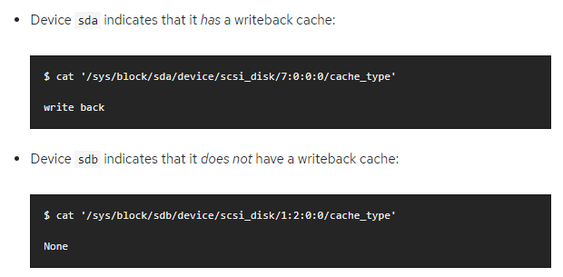
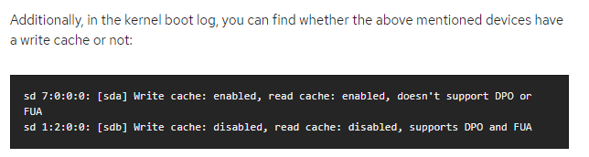
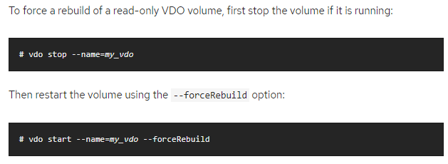
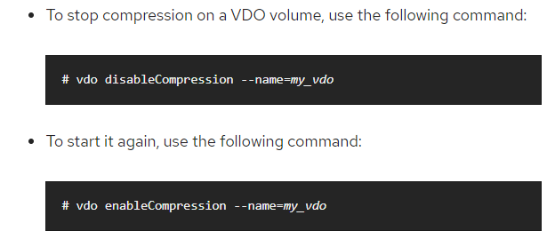
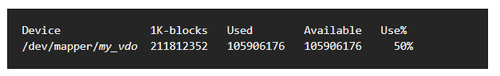
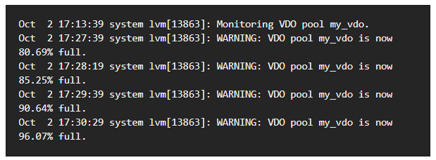
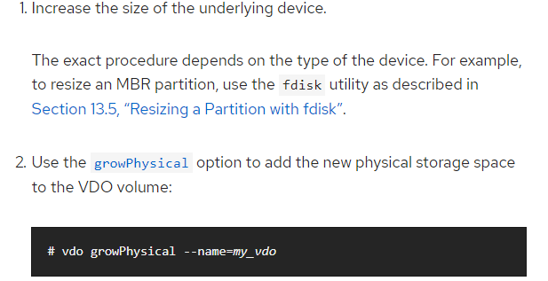

#### 3.10 VDO阅读笔记 29.4

---

##### 29.4.1 Starting or Stopping VDO

* 通过`vdo start --name=myvdo`启动VDO并连接UDS index
* 通过`vdo stop --name=myvdo`停止VDO，时间和storage device的速度和需要写入的data量有关

* VDO的rebuild
  * 在sync mode，在shutdown前被ack的write会被rebuild
  * 在async mode，在最后一个ack flushrequest前被ack的write会被rebuild
  * 两种mode都可能会有数据丢失

---

##### 29.4.2 Selecting VDO Write Modes

* sync mode： 文件系统和应用不需要通过flush或force unit access（FUA）来持久化数据；在storage没有volatile write cache和write through cache时，VDO使用sync mode
* async mode： 如果底层存储不能保证在write command结束时data已经持久化了，就应该用async mode
  * 在async mode下，VDO是不符合ACID的，如果上层假设VDO volume有ACID特性，使用async mode可能会造成意料外的数据丢失
* auto mode： 根据device特性选择sync和async

* 可以用`--writePolicy`设置write policy，可以通过`vdo changeWritePolicy --writePolicy=async --name=vdoname`来修改write policy
* 通过`/sys/block/block_device/device/scsi_disk/identifier/cache_type`来检查device是否有writeback cache

* kernel boot log里也会有device的信息

---

##### 29.4.3 Removing VDO Volumes

* 通过`vdo remove --name=myvdo`移除VDO并切断和UDS index的交互

* 如果remove失败，可能是由于volume此时处于中间状态，比如system crash，power fail，admin interrupt等情况，此时可以加上`--force`

---

##### 29.4.4 Configuring the UDS Index

* VDO使用UDS这种高性能的deduplication index来检测重复block
  * deduplication window是指之前已经写入的、同时index中有的block数量，deduplication window的大小是可以设置的
  * 对于给定的window size，会需要相对应的RAM amount和disk space
  * window size可以通过`--indexMem=size`来指定
* RedHat推荐使用的是sparse UDS index，这种方式比较有效：在deduplication window只需要存储block的1/10大小，会节省DRAM；在disk上，每个block需要72 byte
  * sparse index的最低配置是256 MB的DRAM和25 GB的disk
  * 要做特别配置的话，要在`vdo create`的时候指定`--sparseIndex=enabled --indexMem=0.25`，这种配置下deduplication window能够remember history有2.5 TB
  * 通常情况下，2.5 TB的window足够用于10 TB的data
* 不过，index的默认配置是dense index，这种配置会需要10倍多的DRAM，但能够减少10倍的disk需要，在现实中使用起来方便一点
* 通常来讲，deduplication window是VDO volume phyical size的1/4，是一个理想的数字，但实际上稍微低于这个数字在现实中也是够用的

---

##### 29.4.5 Recovering a VDO Volume After an Unclean Shutdown

* 如果shutdown unclean，VDO需要做rebuild；data recovery会和write policy有关
  * 在sync mode，所有被写入volume的数据都会被完整recovery
  * 在async mode，如果还没执行flush，或带有FUA (force unit access) 的write IO，那一些写入是不会丢失的；相关的指令有`fsync fdatasync sync umount`

##### Online Recovery

* 大多数recovery的工作可以等VDO重新启动，能提供read/write request的时候再说
  * recovery一开始read/write可用空间是有限的，随着metadata的recovered，可用空间会越来越多
  * 在还没有recover的volume上，可能出现 现在写入的data 和 crash之前写入的data 发生deduplication冲突，导致write fail
  * 在recover过程中，data可能会被压缩，然后覆写之前的块
* 在online recovery的过程中，`blocks in use`和`blocks free`是不可用的

##### Forcing a Rebuild

* VDO自身的online recovery能解决大部分的问题；如果失败，VDO volume会暂时被置为read only，这时候对于data loss和data corrupte毫无保障
  * RedHat推荐把read only的数据拷贝出来，存到backup volume（`vdostats`中的`operating mode`就是指目前VDO Volume处于read only mode）
  * 如果可以接受一定程度的data corruption，可以对VDO做force offline rebuild

---

##### 29.4.6 Automatically Starting VDO Volumes at System Boot

* 在system boot期间，vdo systemd unit会自动将所有configure成activated的VDO device启动

* 为防止某些已经existing的volume被自动启动，可以deactive掉，`vdo deactivate --name=myvdo`；相对的，也可以用`vdo activate --name=myvdo`来设置active状态，也可以在`vdo create`的时候设置`--activate=disabled`
* LVM volume是在VDO volume上层的，启动顺序一定要对
  * LVM的低层要先启动，通常这是在LVM2 package安装时自启动的
  * 启动vdo systemd unit
  * 使用additional scripts启动LVM

---

##### 29.4.7 Disabling and Re-enabling Deduplication

* 在某些情况下，可能需要暂时禁用写入VDO Volume时的去重功能，但同时要仍然保留对VDO Volume读写的能力
  * 通过指令`vdo disableDeduplication --name=myvdo`禁用去重，切断和UDS index的联系
  * 重启的指令是`vdo enableDeduplication --name=myvdo`
  * 也可以在`vdo create`的时候设置`--deduplication=disabled`

---

##### 29.4.8 Using Compression

##### Introduction

* 除了block-level deduplication，VDO还提供了inline block-level compression，使用HIOPS Comperssion technology
  * deduplication对VM environment和backup application非常有效
  * compression对block-level的冗余有效，比如log file和database
* 对于没有被去重掉的block，会做压缩；压缩是基于一个并发的packageing algorithm，所以可以同时处理多个compresson operation
  * 当把第一个block存入physical block后，会有一个best-fit packing algorithm来寻找最适合放入的block
  * 当physical block看起来不再能存放更多的compressed blocks时，它被写入底层stoarge，然后清空reuse
  * 优化compression和packering可以提升性能

##### Enabling and Disabling Compression

* VDO的compression是默认开启的；可以在`vdo create`时通过`--compression=disabled`来关闭
* 如果为了最大化speed性能，也可以把compression关掉

---

##### 29.4.9 Managing Free Space

* 由于VDO是thin provisioned block storage，VDO实际使用的physical space和给用户展现的可用空间是不同的；这种差异可以用来节约存储成本，但是要小心越界

* 因为越界很危险，指logical blocks超过physical blocks，所以使用VDO必须提供一种监控VDO free pool的方法，就是用`vdostats`
  * `vdostats`的输出有点类似于Linux的`df`

* 如果VDO volume的physical storage capacity快满了，VDO会报错；这个时候administrator最后采取行动来删数据，或者增加physical storage，或者删掉LUNs

##### Reclaiming Space on File Systems

* 除非file system使用`discard trim unmap`等指令，VDO是不会回收空间的；如果不适用这些指令，也可以人工回收空间，通过往文件里写binary zero，然后delete掉
* 文件系统通常可以用以下两种方式发出discard请求
  * Realtime discard / online discard / inline discard： 设置这个的时候，file system会给block layer发`REQ_DISCARD`请求，VDO接收到请求后，返回free pool的空间
    * 可以在mount的时候设置`discard`选项
  * Batch discard： 这是用户发起的操作，会让file system来告知block layer(VDO)  还有多少unused block；通过向file system发叫做`fitrim`的`ioctl`指令

##### Reclaiming Space Without a File System

* 即使没有file system也可以管理free space；安装LVM（logical volume manager）后，single VDO可以被分为multiple subvolume
* 在给volume资源之前，可以通过`blkdiscard`指令预先free需要使用的logical volume
* LVM支持`REQ_DISCARD`，SCSI device支持`UNMAP`，ATA device支持`TRIM`

##### Reclaiming Space on Fibre Channel or Ethernet Network

* VDO volume也可以用于光纤信道和以太网

---

##### 29.4.10 Increasing Logical Volume Size

* 可以通过`growLogical`指令来实现

---

##### 29.4.11 Increasing Physical Volume Size

* 先增加underlying device的大小，可以用`fdisk`，来resize MBR partition；再通过`growPhysical`指令来实现

---

##### 29.4.12 Automating VDO with Ansible

* 用Ansibe tool自动化完成VDO的部署和管理