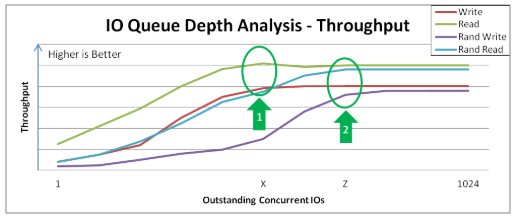
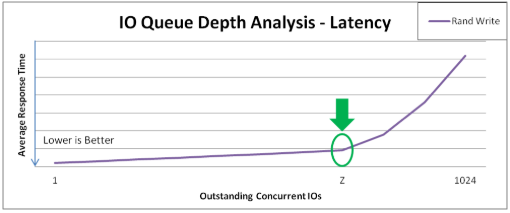
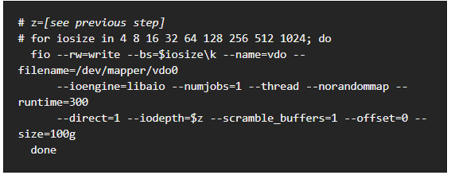
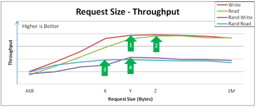
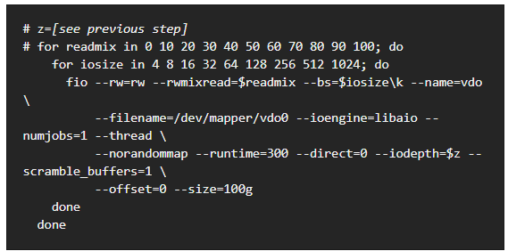
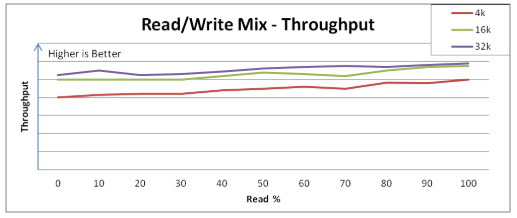
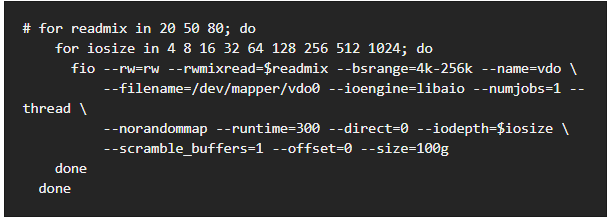
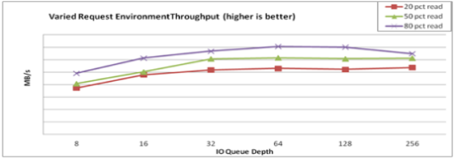

#### VDO阅读笔记 30.4

---

```
VDO相关
29. VDO Integration
	29.1. Theoretical Overview of VDO
	29.2. System Requirements
	29.3. Getting Started with VDO
	29.4. Administering VDO
	29.5. Deployment Scenaios
	29.6. Tuning VDO
	29.7. VDO Commands
	29.8. Statistics Files in /sys
30. VDO Evaluation
	30.1. Introduction
	30.2. Test Environment Preparations
	30.3. Data Efficiency Testing Procedures
	30.4. Performance Testing Procedures
	30.5. Issue Reporting
	30.6. Conclusion
```

---

* 每个测试都要在with VDO和without VDO两种情况下测，形成对照

##### 30.4.1. Phase 1: Effects of I/O Depth, Fixed 4KB Blocks

* 这个测试是寻找最优的IO depth；VDO用的是4KB的sector size，没有用传统的512B，优点是支持higher-capacity storage，提升性能，和大多数OS用的cache buffer size匹配
* 测试iodepth为1 2 4 8 16 32 64 128 256 512 1024 2048的性能，测试用例分别是read，write，randread，randwrite
  * 在X之后，iodepth再大就不影响sequential rw性能了；在这之前，吞吐量上升，延迟随新增的request数量上升
  * 在Z之后，iodepth再大就不影响rand rw性能了；在这之前，吞吐量上升，延迟随新增的request数量上升





---

##### 30.4.2. Phase 2: Effects of I/O Request Size

* 测block size（bs）的影响，范围是4 8 16 32 64 128 256 512 1024，也是顺序随机读写5中
* 



---

##### 30.4.3. Phase 3: Effects of Mixing Read & Write I/Os





---

##### 30.4.4. Phase 4: Application Environments






