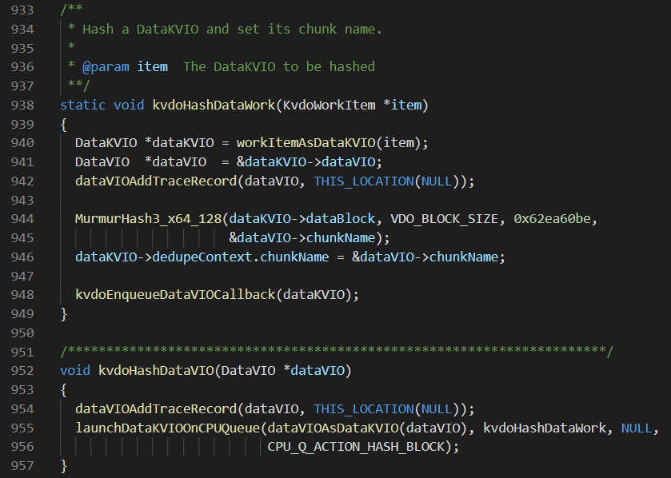

#### 2.29 HashLock 代码

---

```
qihua给的优化方向：
journal的优化
去重的hash可以用QAT做
QAT有hash和压缩chain在一起的功能
```

```
hash应该是vioWrite里面prepareForDedupe最后一句做的hash，然后enterHashLock进入hashLock，在这里面去和uds模块交互query是否之前有index
```

```
[ base/vioWrite.c ]
- void prepareForDedupe(VDOCompletion)
注释：在sync write或async allocation之后调用，用来准备dedupe path；
	在updateBlockMapForWrite()中注册这个回调用于同步，
	在continueWriteAfterAllocation()中通过acknowledgeWrite()注册这个回调用于异步；
	当allocation失败时，也可以直接由后者调用。

if (!isAsync(dataVIO)){} 	通过isAsync获取writePolicy

dataVIO->lastAsyncOperation = HASH_DATA;	在进行dedupe之前，我们需要知道chunk name，因此第一步是对block data做hash

setAllocatedZoneCallback(dataVIO, resolveHashZone, THIS_LOCATION(NULL));
completion->layer->hashData(dataVIO);
运行这个回调的线程是错误的，但目前没办法在hash之后立刻在那个CPU thread上运行
# this is the wrong thread to run this callback, but we don't yet have a mechanism for running it on the CPU thread immediately after hashing.

- static inline bool isAsync(DataVIO *dataVIO)
{
  return (getWritePolicy(getVDOFromDataVIO(dataVIO)) == WRITE_POLICY_ASYNC);
}
使用情况：abortOnError()判断是否readonly
	abortDeduplication()判断是否需要writeBlock()
	incrementForCompression()
	incrementForDedupe()，同上，与hasAllocation一起判断
	prepareForDedupe()判断是否要更新dataVIO->mapped, 比较有参考价值
	updateBlockMapForWrite()
	getWriteIncrementCallback()
	continueWriteAfterAllocation()判断是否需要writeBlock()
```

``` 
Future work 2：Hash Optimization
- Hash-compress chain
- Collision using compressed result to compare

[ kernel/kernelLyaer.c ]
layer->common.hashData = kvdoHashDataVIO;

[ kernel/dataKVIO.c ]
void kvdoHashDataVIO(DataVIO *dataVIO)
static void kvdoHashDataWork(KvdoWorkItem *item)

[ uds/murmur/MurmurHash3.c ]

```



