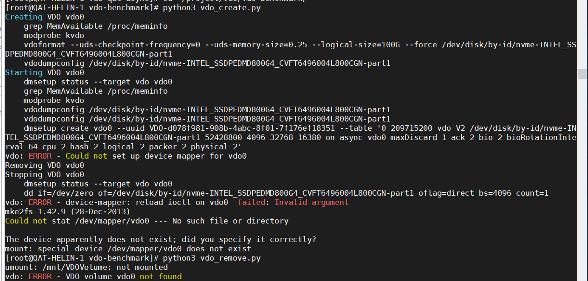

#### 3.24 VDO front end 代码

---


```
关键词：writepolicy，不区分大小写

example/ansible:
test_vdocreate_alloptions.yml	1
vdo.py							11

utils/vdo/base:
compressionState.c				1
statistics.h					1
types.h							3
vdo.c							9
vdo.h							4
vioWrite.c						1

vdo-manager/man:
vdo.8							9
vdostats.8						1

vdo-manager/statistics:
VDOStatistics.py				1
Defaults.py						2

vdo-manager/vdomgmnt:
VDOArgumentParser.py			10
VDOOperation.py					10
VDOService.py					42
```

```
vdo/base/中修改过的内容

dataVIO.h
qat.c
qat.h
qatCompress.c
qatInternals.h
statistics.h
types.h
vdo.c
vdo.h
vioWrite.c
zlib.c
zlib.h
```

```
vdo.spec

%files
#defattr(-,root,root)
%{_bindir}/vdo
%{_bindir}/vdostats
%{_bindir}/vdodmeventd
%{_bindir}/vdodumpconfig
%{_bindir}/vdoforcerebuild
%{_bindir}/vdoformat
%{_bindir}/vdoprepareupgrade
%{_bindir}/vdoreadonly

---

utils/vdo/user/Makefile

PROGS = vdodmeventd        \
        vdodumpconfig      \
        vdoforcerebuild    \
        vdoformat          \
        vdoprepareupgrade  \
        vdoreadonly
```




