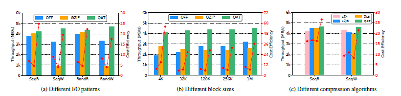

#### 3.3 fio测试

---

```
by helin

比较各个版本的实验效果，类似于QZFS里面micro那种
那就是off lz4 zlib qat qat-async（可以不要） multipacker，比较这五个版本
	off: 调整--compression=disable
	lz4: /home/hlguo/kvdo
	zlib: /home/hlguo/kvdo-zlib
	qat: /home/hlguo/kvdo-qat/kvdo-master
	qat-async: /home/hlguo/kvdo-qat/async-qat 或 code-qat-async
	multipacker: /home/hlguo/kvdo-qat/code-multi-packer

这里面唯一有点需要考虑的就是 给cputhread分配1-2个core可能有点太少了，试一下给它固定到4个上
因为2个core在off的情况下都是60%+占用率

你看主函数run_benchmark，vdo.create是从vdo_package参数获取各项配置的，如果要固定一项，比如cpu在这里改成固定数值，然后后面hash logical等下标编号前移，下面grid_search调用参数改成长度为6，应该就可以了。或者直接在vdo_helper里面把create默认参数设置好，然后外面不给指定这个参数也行。改vdo_create_shell也行吧，但是外面的循环就多了一些无意义的

python3 run_benchmark.py
```



