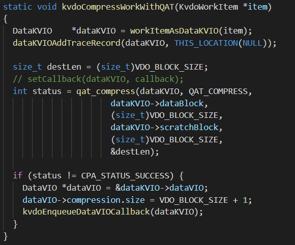
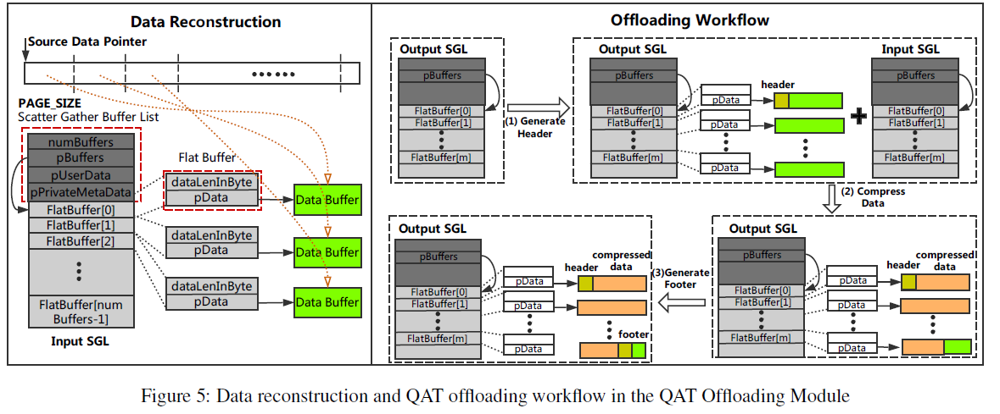
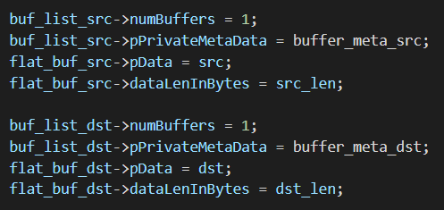
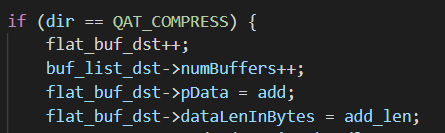
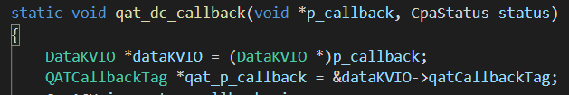
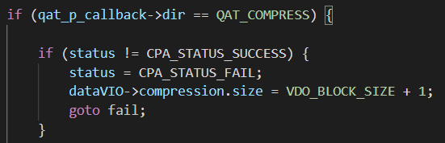
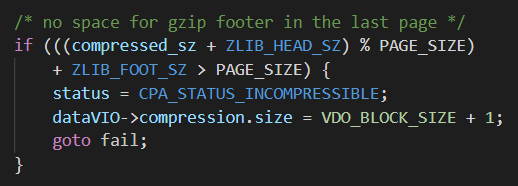
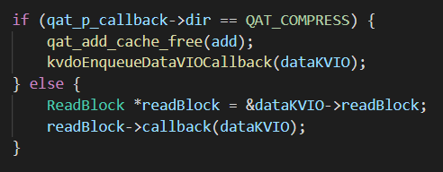

#### 3.4 qatCompress 代码

---



```
QATCallbackTag:
	CpaDcRqResults dc_results;
	qat_compress_dir_t dir;
	Cpa16U i;
	Cpa8U *buffer_meta_src;
	Cpa8U *buffer_meta_dst;
	CpaBufferList *buf_list_src;
	CpaBufferList *buf_list_dst;
	char *add;

在发给QAT的数据里，还有一个保存着context的结构，QATCallbackTag，包含3个variable field和4个memory pointer：
- dc_direction, 记录QAT hardware是做压缩还是解压缩，不只是选算法，也会影响接下来的执行过程
- dc_inst_num, 用于这个compression request的instance number，这个值的取值范围有QAT hardware来决定，QAT中有这个参数并行上限的限制
- dc_result，获取request result，比如produced/consumed data size
- memory pointer，包含两个buffer list pointer，两个metadata buffer pointer，在hardware processing中会用到，在callback routine中被free

```


```
qatCompress.c

static void *qat_add_cache_alloc(void)
static void qat_add_cache_free(void *add_cache)
boolean_t qat_dc_use_accel(size_t s_len)
static void qat_dc_callback(void *p_callback, CpaStatus status)
static void qat_dc_clean(void)
int qat_dc_init(void)
void qat_dc_fini(void)
static int qat_compress_impl(DataKVIO *dataKVIO, char *src, 
	int src_len, char *dst, int dst_len, char *add, int add_len, 
	size_t *c_len)
int qat_compress(DataKVIO* dataKVIO, qat_compress_dir_t dir, char *src, 
	int src_len, char *dst, int dst_len, size_t *c_len)
	
调用情况分析：
qat_compress：被kvdoCompressWorkWithQAT和uncompressReadBlockWithQAT调用
qat_compress_impl：仅被qat_compress调用
qat_dc_init：仅被qat.c中qat_init调用，变量qat_dc_init_done
qat_dc_fini：仅被qat.c中qat_fini调用
qat_dc_clean：在qat_dc_init fail时，和qat_dc_fini中被调用
qat_dc_callback：在qat_dc_init中作为参数
```

##### 代码结构

- init： `vdologicalthread, vdophysicalthread, ...`
- `kvdoCompressDataVIO`
  - 分配两个2 CPU
  - ```launchDataKVIOOnCPUQueue(dataKVIO, kvdoCompressWorkWithQAT, NULL, CPU_Q_ACTION_COMPRESS_BLOCK);```
  - 可能有一个很高的点，指定具体哪一个做
  - 【point】可以在这里读一个配置文件，来支持QAT和LZ4两种操作；生成vdo的时候设置一个参数（用什么），整个都要用这个参数
- 在这之前，`startWriting`或者 `compressData` 中，会定下一个 需要入queue的操作
- `kvdoCompressWorkWithQAT`
  - `qat_compress`，**只要确认QAT接收到，send success就会返回，**就会 `status = CPA_STATUS_SUCCESS` （没成功是要retry，或者只retry 1次）
  - `DataVIO` 是 整个vdo里面的struct；`DataKVIO` 是kernel VIO，和盘有关系用KVIO，没关系用VIO
- `kvdoEnqueueDataVIOCallback`
  - 执行下一步，无论成功失败都要进来（`qatcompress.c` 成功会进来）
  - 这是个入队的东西；队列下一个是谁在很早很早，压缩之前，就定好了
  - 里面的内容就是enqueue
- `qatcompress.c ，qat_compress` 
  - `qat_compress` 是自己写的函数
  - `QATCallbackTag` 里面有乱七八糟的tag，获取数据长度
- `qatInternals.h，QATCallbackTag`
  - `CpaDcRqResults dc_results;` 是用来get data length
  - `qat_compress_dir_t` 记录是压缩还是解压，因为后续操作不一样；压缩是小的拼接成大的，解压缩只是把数据返回给上层
  - `Cpa16U i`是instance数，通常48
  - `bufferlist`，问题是什么时候free，现在的实现是等async返回后再free掉buffer，但这个似乎不太合理，可以改的，但问题是sender怎么知道receiver什么时候可以不用这段buffer了；同步就是返回以后free
  - add，有的时候压缩以后可能还会变大 ( ？)；担心特殊情况的溢出；参考当时ZFS patch里面提到的事情
  - 这个就是安格传过去的structure；压缩需要额外的空间防止出错，就是那个add



- `qat_compress_impl`

  - 一个bufferlist 分为前面的metadata和后面的flatbuffer

  - `buf_list_src->pBuffers = flat_buf_src; /* always point to first one */`

  - pbuf 永远指向第一个

  - `qatCompress.c`   436-444 可以阅读ZFS的代码，那里有一些优化点；这里为了简单就去掉了；之后可以再看看加回来

    - 现在的代码和ZFS有变化，是可以改的

    

  - `qatCompress.c`   452-455 是compress 的时候有add，要多加一个页，这里都是在做这个事情

  

  - 压缩代码的格式 是 header+payload+tailer；现在异步，要在压缩完以后再添加这么一个tailer，会比较麻烦
    - 现在就是先 `cpaDcGenerateHeader`生成头，然后去做压缩，最后再异步回调后，再次调用，来生成尾
    - 解压就没有头尾的事情了
  - DMA读取连续4K会方便一点

- `qat_dc_callback`

  - `qatcompress.c` 的 init函数里面会调用

  - `dc_results` 实在是没办法（压缩后的长度），只能存在那个structure里面

  - `qatCompress.c`   73-74 这么写的原因不记得了；其实想要`QATCallbackTag`，为什么要封装一层`DataKVIO`；

    - 可以把`DataKVIO`也放进`QATCallbackTag`

    

  - `qatCompress.c`   90开始，要决定之后要做什么

    - 压缩之后要发给packer，解压之后要发给reader

  

  - `qatCompress.c`   106, `ZLIB_FOOT_SZ` 是定值，这个if处理就直接不要了，是一个corner case

  

  - 如果 `dataVIO->compression.size = VDO_BLOCK_SIZE + 1` ，就表示uncompressible，不然的话就是压缩过，可以从data那里拿到
  - `qatCompress.c`   163-169，这个代码结构很神秘

  

- 跟磁盘有关系的都在kernel里面，base里面是一些别的辅助

- `base/lz4`

- `kvdoCompressWork`

  - 标准工作函数，调用lz4
  - `LZ4_compress_ctx_limitedOutput` 返回值是size，中间不会block，都是数学逻辑；如果返回size小于0，就会认为这是uncompress data，不可压数据，没有改动，读的时候就不用做改动，直接读；反过来就是可压缩数据，读的时候就要解压一下


- QAT compress 后面有packer和journal，journal现在都没改

