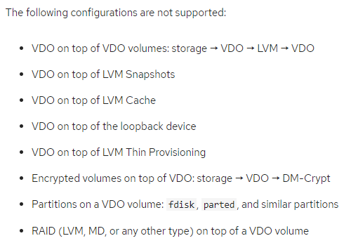
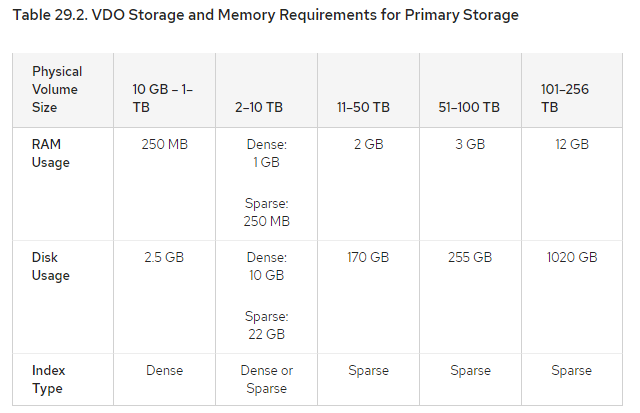
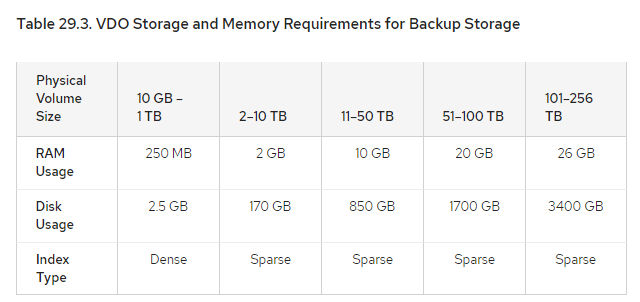

#### 3.7 VDO阅读笔记 29.2

##### System Requirement

---

##### Processor Architectures

* 一个或多个有Intel 64位指令集的processor；AMD 64或Intel 64都可以

##### RAM

* 每个VDO Volume有两个不同的memory需求
  * VDO module需要370MB，再加上每1TB physical storage的管理所需的268MB内存
  * UDS index需要至少250MB的DRAM，这是deduplication要用的默认大小
* 29.2.1 有UDS index Memory Requirement

##### Storage

* 为防止VDO Volume内存溢出，将volume放在storage可以expand的top位置，expandable storage可选LVM volume和MD RAID array
* single VDO volume配置后，最多可以使用256TB的physical storage
* 29.2.2 有 VDO Storage Space Requirements

##### Additional System Sostware

* VDO需要LVM和Python 2.7；可以用yum安装

##### Placement of VDO in the Storage Stack

* 通常来说，要把certain storage layer放在VDO下层，其他的放在VDO上层
  * VDO下层：DM-Multipath, DM-Crypt, software RAID (LVM or `mdraid`).
  * VDO上层：LVM cache, LVM snapshots, LVM Thin Provisioning.

* 以下的一些配置是是不支持的

* 重要的是，VDO有两个write mode，sync和async；sync在底层写完才返回，async在底层写完之前就会返回。设置write policy可以匹配底层的storage
  * 29.4.2有Selecting VDO Write Modes

---

##### 29.2.1 UDS Index Memory Requirement

* UDS index包括两部分
  * 在memory中使用紧凑的compact representation，一个unique block最多一个entry
  * 一个disk上的组件，按照顺序记录index中出现的相关的block name
* UDS在memory和cache中，一个entry平均4个byte

##### UDS的工作原理

* disk上有一个组件，维护传递给UDS数据的一个历史记录，但是是有限的
* UDS通过deduplication window提供去重服务，包括最近看到的block name；deduplication window可以使的index到large data repository时尽可能的高效，不需要很多的memory
* 大部分的dataset都可以程度不低的去重，因为有空间局部性；也就是说，大量的deduplication都发生在同一时间写入的block set中
  * data去重更有可能是去掉最近写过的新数据，而不是旧数据
  * 所以对于给定的workload和给定的time interval，UDS index保存recent data和all data时，最终的去重率是基本差不多的
* 因为data deduplication有局部性，所以不需要讲所有block都index到存储中，这会减少去重带来的空间节省
* deduplication window的index size取决于数据的单次读取量，data ingestion；比如100TB的数据，每周读取1TB，那么4TB的deduplication window就已经绰绰有余
* UDS的Sparsing Indexing特性可以通过保留最相关relevant的数据来保持局部性；UDS的deduplication window可以实际指向10倍memory的空间
  * 当稀疏索引sparse index有更高的覆盖率，密集索引dense index提供更好的指向性
  * 对大多数workload，sparse index和dense index的区别是可以忽略不计的
* index的memory需求取决于deduplication window所需要的size
  * 对dense index的deduplication window来说，1TB的数据用1GB的RAM来映射；通常1GB最多index 4TB的数据的
  * 对sparse index的deduplication window来说，10TB的数据1GB的RAM来映射；通过1GB最多index 40TB的数据的
* 29.2.3有Examples of VDO System Requirements by Physical Volume Size

---

##### 29.2.2 VDO Storage Space Requirements

* VDO在两方面需要storage space，分别是VDO metadata和实际的UDS deduplicaition index
* VDO写入的metadata有两种类型
  * 第一种是scale with physical size of VDO Volume, 大约每4GB的physical storage用1MB，每个slab用1MB
  * 第二种是scale with logical size of VDO Volume，大约每4GB的logical storage用1.25MB，四舍五入到最近的slab
  * 29.1.3 VDO Volume有介绍过slab
* UDS index和VDO Volume group一起存，由VDO instance管理
  * UDS index的storage require与index type和RAM分配给index的空间有关
  * 通常1GB的RAM，dense UDS index可以映射17GB，sparse UDS index可以映射170GB
* 29.2.3是一个实例

---

##### 29.2.3 Examples of VDO System Requirements by Physical Volume Size

* 下面的表格是VDO大致需要的存储大小

##### Primary Storage Deployment

* 在primary storage case中，UDS index是physical volume size的0.01% - 25%

##### Backup Storage Deployment

* 在backup storage case中，UDS index覆盖了整个set但不超过physical volume size；在数据量大的时候增幅比较明显

