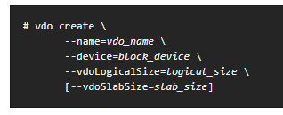
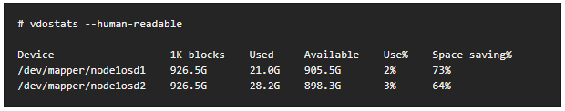
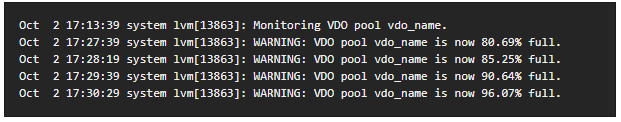
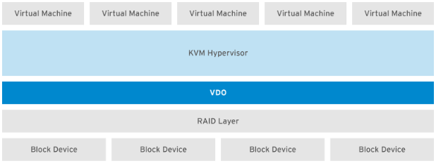

#### 3.7 VDO阅读笔记 29.3

##### Getting Started With VDO

---

##### 29.3.1 Introduction

* VDO提供了一系列inline data reduction策略，包括deduplication、compression和thin provisioning；当set up VDO Volume时，要特别指定一个block device来构造VDO Volume，并且提供VDO所需的logical storage
  * 在把VDO host在active VM或container上时，RedHat建议按照10:1的 logical/physical比率来提供存储
  * 对于object storage，比如Ceph，RedHat建议按照3:1的 logical/physical比率来提供存储
  * 无论那种情况，都可以简单地把file system放在VDO上层，然后直接把VDO当成分布式云存储的一部分

* 下文描述了VDO部署的一些use case
  * 虚拟化server的direct-attached usecase，比如用RedHat Virtualization的
  * object-based分布式存储集群的cloud storage usecase，比如用Ceph Storage的
  * 29.3.5有Deployment Examples

---

##### 29.3.2 Installing VDO

* 用yum来装，`yum install vdo kmod-kvdo`

---

##### 29.3.3 Creating a VDO Volume

* multiple VDO可以在same machine的separate device上被创建，但是要注意每个VDO instance的name不能一样

* 创建步骤
  * Create the VDO Volume using the VDO Manager
  * Create a file system
  * Mount the file system
  * To configure the file system to mount automatically, use either the `/etc/fstab` file or a systemd mount unit
  * Enable the `discard` feature for the file system on your VDO device. Both batch and online operations work with VDO.
    * discard的更多信息在2.4 Discard Unused Blocks

* 创建VDO Volume
  * block_device是想用创建VDO Volume的block device
  * logical_size的比例前面有讲
  * 如果block device比16TB还大，可以把vdoSlabSize设为32G；用默认2GB的slab size在16TB的device上做vdo create会报错
  * 当VDO Volume创建成功，VDO会在`/etc/vdoconf.yml`添加自己的配置文件
  * `vdo.service`这个unit是用来默认start volume的

* 可以修改`etc/fstab`文件或者弄一个systemd mount unit来自动配置文件系统和挂载

---

##### 29.3.4 Monitoring VDO

* 因为VDO是thin provisioning的，所以file system和application只会关心logical space是使用，不会关心实际的physical space
* VDO的space usage和efficiency都可以用`vdostats`来看

* 当physical storage快占满的时候，VDO会报错

---

##### 29.3.5 Deployment Examples

