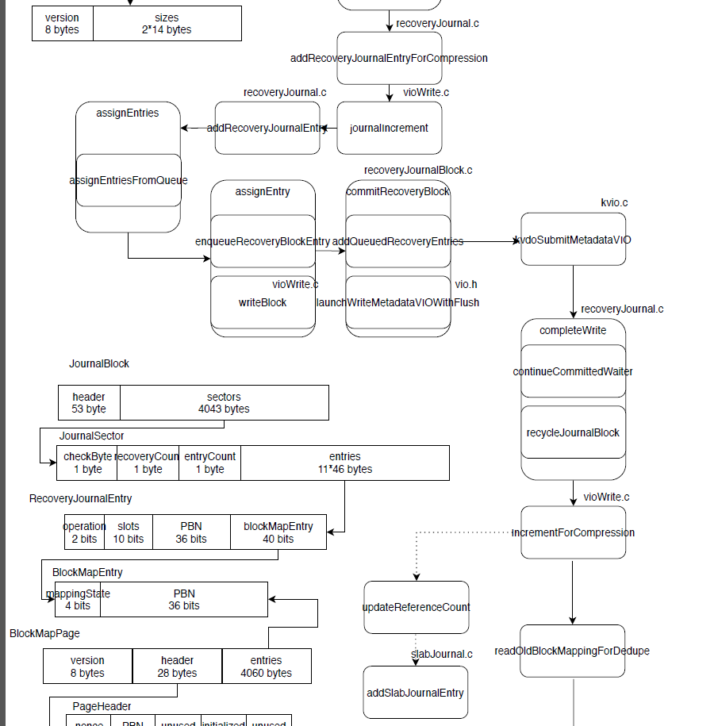
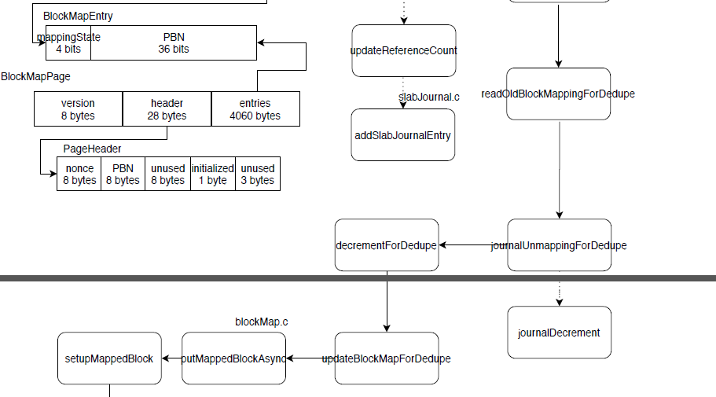

#### 4.18 RecoveryJournal

---

```
修改文件

threadConfig.h	ThreadConfig类
				makeThreadConfig()
				getJournalZoneThread()
threadConfig.c	allocateThreadConfig()
				makeThreadConfig()

deviceConfig.h	ThreadCountConfig类
deviceConfig.c	processOneThreadConfigSpec()
				parseDeviceConfig()

completion.h	VDOCompletionType类
completion.c	VDO_COMPLETION_TYPE_NAMES[]

dataVIO.h		dataVIO类
dataVIO.c		【TODO】，dataVIO->recoveryJournal的初值

recoveryJournalInternals.h	RecoveryJournal类
recoveryJournal.h		【TODO】	
recoveryJournal.c		getJournalFromDataVIO()
						getJournalZoneThreadID()
						【TODO】

vdoInternals.h	VDO类
vdo.c			destroyVDO()
				selectJournalZone()
				【TODO】，关于vdo->recoveryJournals

与getJournalZoneThread()相关：
blockMap.c, recoveryJournal.c, slabDepot.c, vdoClose.c, vdoLoad.c

与makeThreadConfig()相关：
kernelLayer.c

vio.h暂时不改(用于packer.c)
flush.c暂时没改
vdoLoad.c暂时没改
vdo.c没改全
dataVIO.c待改
```

```
流程图

[recoveryJournal.c]
addRecoveryJournalEntryForCompression

[vioWrite.c]
journalIncrement

[recoveryJournal.c]
addRecoveryJournalEntry

assignEntries
assignEntriesFromQueue

assignEntry
enqueueRecoveryBlockEntry
writeBlock - vioWrite.c

commitRecoveryBlock
addQueuedRecoveryEntries
launchWriteMetadataVIOWithFlush - vio.h

[kvio.c]
kvdoSubmitMetadataVIO

[recoveryJournal.c]
completeWrite
comtinueCommittedWaiter
recycleJournalBlock

[vioWrite.c]
IncrementForCompression
updateReferenceCount

[slabJournal.c]
addSlabJournalEntry

[vioWrite.c]
readOldBlockMappingForDedupe
journalUnmappingForDedupe
	journalDecrement
	
decrementForDedupe
updateBlockMapForDedupe
```





