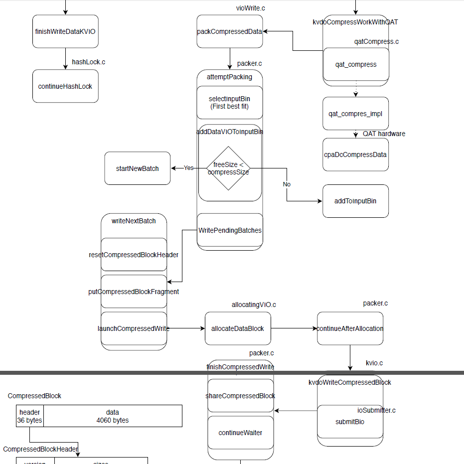

#### 4.18 packer

---

```
学长改multipacker修改过的文件

completion.c	完成
completion.h	完成，修改vdocompletiontype类

dataVIO.c	完成
dataVIO.h	完成，修改dataVIO类，添加packer
	
flush.c 	完成

packer.c
packer.h
packerInternals.h	完成，修改packer类

threadConfig.c		完成
threadConfig.h		增加zonecount和packerthreads的指针
	完成，修改threadconfig类，packercount变为packerzonecount

vdo.c
	修改各种closepacker，flushpacker，dumppacker；selectpackerzone()
vdoClose.c
	完成，使用packer，closePacker函数，连接threadconfig
vdoLoad.c
	完成，修改decodeVDO()
vdoInternal.h
	修改vdo类

vio.h		修改VIO类

vioWrite.c
	修改resolvehashzone()，初始化dataVIO->packer

deviceConfig.c		完成
deviceConfig.h		完成，修改threadcountconfig类

kernelLayer.c
	完成，修改makekernellayer(), 连接threadconfig
kernelVDO.c
	完成，使用packer，连接threadconfig
kvdoFlush.c
	完成，使用packer，连接threadconfig

threadData.c		无

==============

getPackerZoneThread, threadConfig.h中，返回ThreadID
getPackerZoneThreadID, 定义与packer.c中，返回ThreadID

==============

流程图的状态

[dataKVIO.c]
kvdoCompressWorkWithQAT

[qatCompress.c]
qat_compress

[vioWrite.c]
packerCompressedData

[packer.c]
attemptPacking
selectInputBin
addDataVIOToInputBin
(freeSize < compressSize)
	yes -> startNewBatch
	no -> addToInputBin
writePendingBatches

writeNextBatch
resetCompressedBlockHeader
putCompressedBlockFragment
launchCompressedWrite

[allocatingVIO.c]
allocateDataBlock

[packer.c]
continueAfterAllocation

[kvio.c]
kvdoWriteCompressedBlock

[ioSubmiter.c]
submitBio

[packer.c]
finishCompressedWrite
shareCompressedBlock
continueWaiter

[recoveryJournal.c]
addRecoveryJournalEntryForCompression
```



