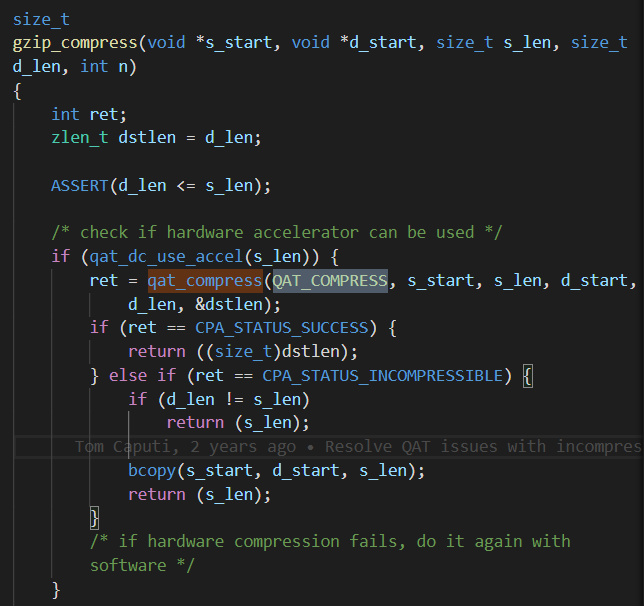
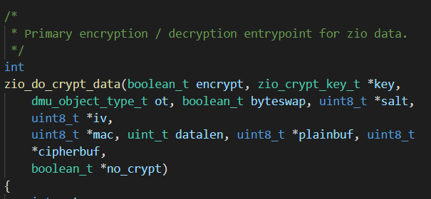
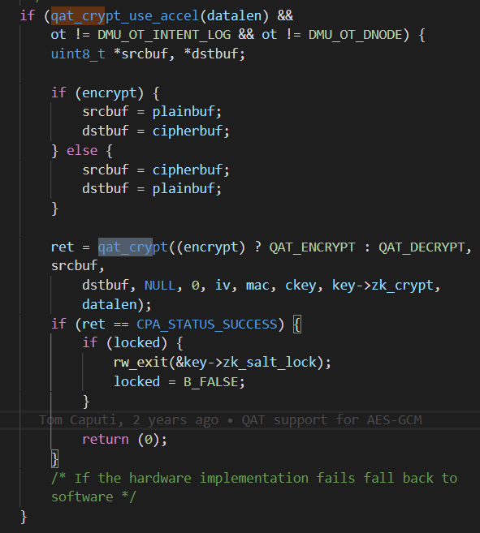
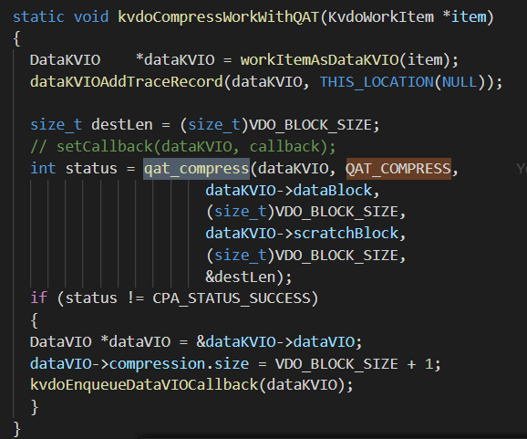

#### 4.6 QZFS Hash

---

```
openzfs:

qat_compress:
- static int
qat_compress_impl(qat_compress_dir_t dir, char *src, int src_len, char *dst, int dst_len, char *add, int add_len, size_t *c_len)
- int
qat_compress(qat_compress_dir_t dir, char *src, int src_len, char *dst, int dst_len, size_t *c_len)

gzip.c gzip_compress

qat_crypt:
- int
qat_crypt(qat_encrypt_dir_t dir, uint8_t *src_buf, uint8_t *dst_buf, uint8_t *aad_buf, uint32_t aad_len, uint8_t *iv_buf, uint8_t *digest_buf, crypto_key_t *key, uint64_t crypt, uint32_t enc_len)
加解密方向，待加密数据存放的地方，加密完数据放在哪，加密用的额外的数据源数据存在哪，长度，加密算法用的初始向量存在哪，摘要相关的，key加密的key，zio的算法选择，待加密数据的长度
- int
qat_checksum(uint64_t cksum, uint8_t *buf, uint64_t size, zio_cksum_t *zcp)
checksum算法的选择，做cksum数据存在哪，大小，zio checksum相关 block会对应多个摘要
```







---

```
qatCompress
- static int
qat_compress_impl(DataKVIO *dataKVIO, char *src, int src_len, char *dst, int dst_len, char *add, int add_len, size_t *c_len)
- int
qat_compress(DataKVIO* dataKVIO, qat_compress_dir_t dir, char *src, int src_len, char *dst, int dst_len, size_t *c_len)

QZFS
qat_compress_impl(qat_compress_dir_t dir, char *src, int src_len, char *dst, int dst_len, char *add, int add_len, size_t *c_len)
- int
qat_compress(qat_compress_dir_t dir, char *src, int src_len, char *dst, int dst_len, size_t *c_len)
```



* 三个问题
  * atomic, zlib, makefile
  * zio-checksum
  * crypto-key-t


---


##### 执行流

```
qat_crtpt.c
int qat_crypt(qat_encrypt_dir_t dir, uint8_t *src_buf, 
	uint8_t *dst_buf, uint8_t *aad_buf, uint32_t aad_len, 
	uint8_t *iv_buf, uint8_t *digest_buf, crypto_key_t *key, 
	uint64_t crypt, uint32_t enc_len)
需要: dir, srcbuf, dstbuf, addbuf, addlen, ivbuf, digestbuf, key, crypt, enclen

zio_crypt.c 
ret = qat_crypt((encrypt) ? QAT_ENCRYPT : QAT_DECRYPT, srcbuf,
		    dstbuf, NULL, 0, iv, mac, ckey, key->zk_crypt, datalen);
int zio_do_crypt_data(boolean_t encrypt, zio_crypt_key_t *key,
	dmu_object_type_t ot, boolean_t byteswap, uint8_t *salt, 
	uint8_t *iv, uint8_t *mac, uint_t datalen, uint8_t *plainbuf, 		uint8_t *cipherbuf, boolean_t *no_crypt)
上层传入: dir=encrypt, srcbuf=plainbuf, dstbuf=cipherbuf, ivbuf=iv, digestbuf=mac, key=ckey(与salt,key,等等相关), crypt=key->zk_crypt, enclen=datalen
生成: addbuf=NULL, addlen=0

[ branch 1 ] 加密
zio_crypt.c 
ret = zio_do_crypt_data(encrypt, key, ot, byteswap, salt, iv, mac,
	    datalen, ptmp, ctmp, no_crypt);
int zio_do_crypt_abd(boolean_t encrypt, zio_crypt_key_t *key,
	dmu_object_type_t ot, boolean_t byteswap, uint8_t *salt, 
	uint8_t *iv, uint8_t *mac, uint_t datalen, abd_t *pabd, 
	abd_t *cabd, boolean_t *no_crypt)
上层传入: key=encrypt, srcbuf=ptmp(pabd和datalen), dstbuf=ctmp(cabd和datalen), ivbuf=iv, digestbuf=mac, key=salt/key, crypt=key, enclen=datalen

arc.c
ret = zio_do_crypt_abd(B_TRUE, &dck->dck_key,
		hdr->b_crypt_hdr.b_ot, bswap, hdr->b_crypt_hdr.b_salt,
	    hdr->b_crypt_hdr.b_iv, mac, psize, to_write, eabd,
	    &no_crypt);
static int l2arc_apply_transforms(spa_t *spa, arc_buf_hdr_t *hdr, 
	uint64_t asize, abd_t **abd_out)
上层传入: srcbuf(to_write太多了), dstbuf=eabd(asize和ismd), ivbuf=hdr(hdr->b_crypt_hdr.b_iv)
生成: key=TRUE(QAT_ENCRYPT), mac=(mac[ZIO_DATA_MAC_LEN]=0), key=dck(spa_keystore_lookup_key), datalen=psize

arc.c
ret = l2arc_apply_transforms(spa, hdr, asize, &to_write);
static uint64_t l2arc_write_buffers(spa_t *spa, l2arc_dev_t *dev, 
	uint64_t target_sz)
	
关于arc中生成iv:
arc_get_raw_params
	bcopy(hdr->b_crypt_hdr.b_iv, iv, ZIO_DATA_IV_LEN);
arc_hdr_realloc_crypt
	bzero(hdr->b_crypt_hdr.b_iv, ZIO_DATA_IV_LEN);
arc_convert_to_raw
	bcopy(iv, hdr->b_crypt_hdr.b_iv, ZIO_DATA_IV_LEN);
arc_alloc_raw_buf	
	bcopy(iv, hdr->b_crypt_hdr.b_iv, ZIO_DATA_IV_LEN);
arc_write
	bcopy(hdr->b_crypt_hdr.b_iv, localprop.zp_iv,
		    ZIO_DATA_IV_LEN);

arc.c
wrote = l2arc_write_buffers(spa, dev, size)
static void l2arc_feed_thread(void *unused)
	
[ branch 2 ] 解密
dsl_crypt.c
ret = zio_do_crypt_data(encrypt, key, ot, byteswap, salt, iv, mac,
	    datalen, ptmp, ctmp, no_crypt);
int spa_do_crypt_abd(boolean_t encrypt, spa_t *spa, 
	const zbookmark_phys_t *zb, dmu_object_type_t ot, 
	boolean_t dedup, boolean_t bswap, uint8_t *salt, uint8_t *iv,
	uint8_t *mac, uint_t datalen, abd_t *pabd, abd_t *cabd,
    boolean_t *no_crypt)

dsl_crypt.c
ret = spa_do_crypt_abd(B_FALSE, spa, zb, hdr->b_crypt_hdr.b_ot,
	    B_FALSE, bswap, hdr->b_crypt_hdr.b_salt, hdr->b_crypt_hdr.b_iv,
	    hdr->b_crypt_hdr.b_mac, HDR_GET_PSIZE(hdr), 
	    hdr->b_l1hdr.b_pabd, hdr->b_crypt_hdr.b_rabd, &no_crypt);
static int arc_hdr_decrypt(arc_buf_hdr_t *hdr, spa_t *spa, 
	const zbookmark_phys_t *zb)

dsl_crypt.c
ret = spa_do_crypt_abd(B_FALSE, spa, &cb->l2rcb_zb,
		BP_GET_TYPE(bp), BP_GET_DEDUP(bp), BP_SHOULD_BYTESWAP(bp),
	    salt, iv, mac, HDR_GET_PSIZE(hdr), eabd,
	    hdr->b_l1hdr.b_pabd, &no_crypt);
static int l2arc_untransform(zio_t *zio, l2arc_read_callback_t *cb)

dsl_crypt.c
ret = spa_do_crypt_abd(B_FALSE, spa, &zio->io_bookmark, 
		BP_GET_TYPE(bp), BP_GET_DEDUP(bp), BP_SHOULD_BYTESWAP(bp), 
		salt, iv, mac, size, data, zio->io_abd, &no_crypt);
static void zio_decrypt(zio_t *zio, abd_t *data, uint64_t size)
生成: ivbuf, digestbuf(mac)

zio.c
zio_push_transform(zio, abd_alloc_sametype(zio->io_abd, psize),
		    psize, psize, zio_decrypt);
static zio_t *zio_read_bp_init(zio_t *zio)
```

